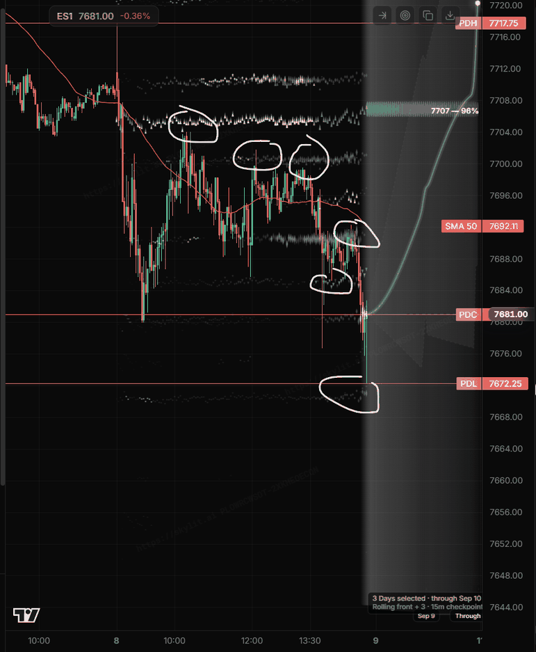
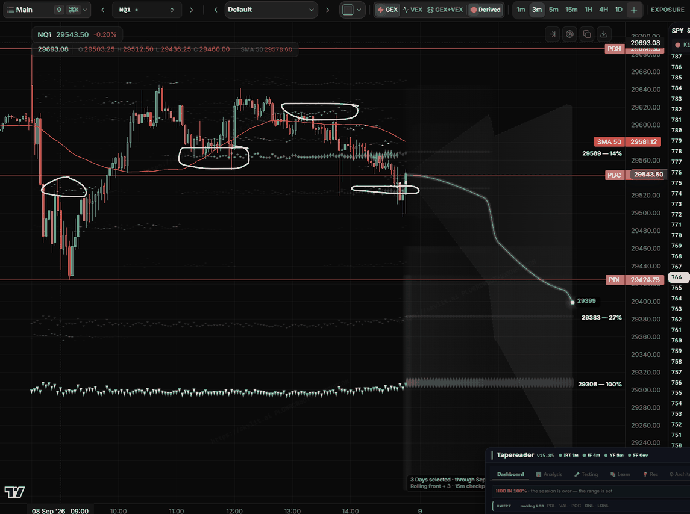

# THE DEFLECTION LEARNING DOC — his examples, my blind calls, the rules they produce

> Operator, 2026-09-03: *"I will be giving you screenshots in a way training you and you will put it into a deflection learning doc, which will be part of your training to get better at identifying deflections … always updating it when i give you examples. and learning until you get really good at identifying deflections."*
>
> **Read this on every load (skills/gex/SKILL.md 1a-00d).** Generated by `tools/learn-seed.py` from the same data the 📚 Learn tab renders (`learning/deflections/examples.json`); pinned by `test_v1562.js`. Never edit the .md by hand — edit the seed.

## 0 · The protocol

1. You paste a screenshot (and, ideally, say nothing yet).
2. I write my BLIND CALL first: kind (HOD/LOD turn · PULLBACK turn · NONE), side, the node I think caused it, the factors I see, confidence.
3. You tell me what it was. If you told me with the screenshot, the example is TAUGHT (recorded, not scored).
4. I pull the panel's own node-event record for those strikes and times and write what the DATA says, with numbers — agreeing or disagreeing with the picture.
5. The example produces or touches a rule (L-n): PROPOSED at n=1, CONFIRMED when three agree and none refutes, REFUTED when one contradicts (it stays, marked). A rule rewritten to absorb its counter-example is a NEW proposed rule and waits for a new example — it is not confirmed by the cases that produced it.
6. My score is blind reads only: right / n, by kind — thin under 15. When it is not thin and not embarrassing, I am getting good.

## 1 · The gauge and my score

**Deflection expertise: 4 / 100** — identify 0/60 (no blind read yet — every example so far was taught with its answer) · predict 0/30 (the scorer is not built (roadmap v15.64)) · breadth 4/10 (6 examples, 3 confirmed rules).

Blind reads only: **thin (n=0)**. No blind read yet — every example so far was taught with its answer.

The gauge is defined so it cannot flatter: identify is the Wilson lower bound of my blind-read accuracy (0 until 5 blind reads); predict is the live call scored by the outcome (0 until the scorer exists); breadth is the only part a taught example can move, and it is capped at 10.

## 2 · The factors I check on every screenshot (his list, made a checklist)

| factor | what it is |
|---|---|
| **NEW NODE** | a strike OBSERVED below the 20% threshold earlier today that crossed it within the last 20 bars AND GREW — ×2 its size at the crossing, or +20% of itself over the growth window (v15.64; the panel's NEW chip). First sight is never a birth: the opening book and the ladder after a reload are not new. His words: 'when price is going to a level, a new node pops up and deflects price. It grew rapidly for this purpose.' |
| **GROWTH INTO THE TAP** | the node's $ exposure rising in the 15 minutes before price reached it (the recorder's d15 > 0, the chart's marker getting brighter) |
| **KING DEFLECTION** | the tap is of THE King — and which book's: SPX (SPXW, the flow book), SPY, or QQQ. His bread-and-butter setup (studies S0.1–S0.7); tracked per book, religiously |
| **HEAVY** | a node ≥ 50% of the King that is not the King |
| **ROLL** | mass moving strike to strike toward or away from price (the ⇄ column; ROLL events) |
| **RUG / REVERSE RUG** | the patternpedia's rug setup: a yellow (+γ) node stacked above a purple (−γ) node with no floor in sight — when the yellow unwinds the drop is violent; the reverse rug is the mirror (purple above yellow, no ceiling). Called per book: SPX · SPY · QQQ |
| **PIKA / BARNEY STACK** | a cluster of LARGE same-sign nodes on adjacent strikes acting as one wall — each member ≥ 30% of the King, the biggest ≥ 40%, named once on the biggest (v15.64) — PIKA when they are yellow (+γ), BARNEY when purple (−γ); called per book: SPX · SPY · QQQ. The docs: 'magnitude matters most here: thin cloud = soft/porous; dense king-level cloud can pin all session.' |
| **MAGNET PULL** | a node growing hard while price sits away from it — price is drawn back to it |
| **SIDE FLIP** | a node that was resistance becoming support once price is above it (or the reverse) |
| **LIQUIDITY LEVEL** | a price level that is not gamma within the zone of the tap — PDH · PDL · PDC · ONH · ONL · AHI · ALO (the Asia session 17:00–02:00 CT) · LHI · LLO (London 02:00–08:30 CT) · the prior day's POC · VAH · VAL · WH · WL. Operator, 2026-09-08: 'the liquidity levels and gamma levels may increase the probability of deflection, so you must look at both and track both' |

Which node caused it, first: look it up in the record (strike, %King, $ exposure, d15, stage, taps, side) before naming the factor.

## 3 · The rules (what I have learned so far)

- **L1 · CONFIRMED (n=24: 19 agree · 5 weak · 0 refute; from E001, E002, E003, E004, E005, E006).** A deflection comes off a node that is GROWING INTO THE TAP. Read the growth in the 15 minutes before the tap (d15), not the size alone; the sign of the gamma did not matter to whether it deflected. *13 of 15 measurable legs (4 legs fell in blind windows). Weak: E002 c2 (7670 −γ roughly flat, −13M → −17M) and E003 c2 (7775 grew +13–15M/15m until 09:57, then d15 +3 → 0 AT the high: the growth stalled at the tap). +γ and −γ nodes both deflected (E001 +γ King; E002 −γ King; E004 −γ King at 10:16 and +γ stack at 12:10). E005 (2026-09-08): agree c1 (7700 +$18–23M/15m into 10:18), c2 (+$28M into 12:06), c4 (the +γ 7670 +$13–15M under the flush; the −γ King itself growing in magnitude), c6 (7665 +$47M, 7670 +$30M into the LOD); weak c3 (the King at its $197M peak, then −$103M/15m the moment the third tap was in) and c5 (7690 d15 +15M then flat at the tap). E006: agree c1 (718 −45 → −59%), c4 (718 −37 → −100% into the low); weak c3 (720 fading 32 → 20% by the ladder — no $ for QQQ).*
  - the record (nightly 2026-09-07): **thin** — held: growing — vs fading — — thin (growing into the tap holds more than fading) · nightly 2026-09-07
- **L2 · CONFIRMED (n=7: 7 agree · 0 weak · 0 refute; from E001, E002, E003, E004, E005).** A FRESH node at the extreme — just crossed the threshold and growing — is a turning-point candidate: the high or low of the leg prints against it. *E001 R3 (7755 born 12:48, the session high); E002 c1 (7665/7670 born 09:21–09:27 −γ, the session low); E003 c2 (7775 born 09:33, the session high), c4 (7720 born 12:39, the 13:12 high), c5 (7705 born 13:42 −γ, the 14:00 low); E004 c1 (7700 fresh 08:45–08:57, the morning support). E005 c6 (7665 crossed 20% at 14:24, 66% and +$47M/15m at the LOD 14:59 — the session low printed on it).*
  - the record (nightly 2026-09-07): **thin** — turn: a NEW node — vs every tap 1 / 28 = 4% (low 1%) — thin (a fresh node at the extreme IS the turn more often than any tap) · nightly 2026-09-07
- **L3 · REFUTED (n=4: 3 agree · 0 weak · 1 refute; from E001, E002, E003, E004).** The King growing hard while price sits away from it PULLS price back to it (magnet) — as first written, without a sign condition. *Held for three +γ Kings — E001 (King $237M → $345M with price above; price back on it by 14:23), E003 c3 (the King rolled DOWN 7790 → 7715 onto price; price rose to it and traded on it 12:36–13:12), E004 c3 (after the 7755 high price returned to the King 7735 by 13:00) — and FAILED for the −γ King of E002 c4 (7675 grew −27M → −116M under price and price rallied AWAY into the 14:59 high). The rule stays here refuted; L8 is the conditioned version and waits for a new example.*
  - the record (nightly 2026-09-07): **not measured** — not measured by the ledger: needs the King path (price pulled back to a growing King) — not a tap class
- **L8 · PROPOSED (n=3: 3 agree · 0 weak · 0 refute; from E001, E003, E004).** A +γ King growing hard while price sits away from it pulls price back to it (magnet): price above a +γ King adding $50–90M per 15 min is a pullback-to-the-King candidate, not a breakout. (L3 with the sign condition the refutation forced.) *Born from L3's refutation, so by the protocol it does not count as confirmed until a NEW example agrees — a rule rewritten to fit its counter-example has not been tested yet. Register candidate H8 is the corpus version.*
  - the record (nightly 2026-09-07): **not measured** — not measured by the ledger: needs the King path with the sign — not a tap class
- **L4 · PROPOSED (n=2: 2 agree · 0 weak · 0 refute; from E001, E002).** A node's SIDE FLIPS when price crosses it: the earlier resistance node re-growing under price is the pullback support. Look for the re-growth (a TURN_UP after a decay), not for a new strike. *E001 Pb (7740: 80% resistance at 10:16 → decayed → support from 10:42 → re-grew from 11:15 → held 12:36); E002 c4 (7675 pierced at 13:39 'above' then reclaimed 'below', then the King).*
  - the record (nightly 2026-09-07): **not measured** — not measured by the ledger: needs the side flip (a node re-growing under price) — not a tap class
- **L5 · PROPOSED (n=10: 9 agree · 1 weak · 0 refute; from E002, E003, E004, E005, E006).** A −γ node growing next to price ACCELERATES price away from it — a −γ node under price is a launch pad, above price a lid; it does not hold price the way a +γ node does. *E002 c2 and c4 (−γ under price → up), E003 c5 (−γ 7705 under the 14:00 low → up), E004 c2 (−γ King 7735 above the 10:16 high → down). Unclear: E003 c3 (−γ 7710 at ES 7718 grew after the 12:06 low while price sat on it — the +γ King above was pulling). E005 c4 and c6 (the −γ King 7680 under price: the flush ran 10–15 pts THROUGH it both times and the turn came at the +γ node beneath); E006 c1 (−γ 718 above price = the lid on the opening drive's bounces), c2 and c4 (the −γ Kings 719 / 718 as floors, overshot 16 and 28 pts, reclaimed).*
  - the record (nightly 2026-09-07): **thin** — held: a −γ node 1 / 5 (thin) vs a +γ node — — thin (a −γ node holds less than a +γ node) · nightly 2026-09-07
- **L6 · CONFIRMED (n=5: 5 agree · 0 weak · 0 refute; from E001, E002, E004, E005).** A STACK — two nodes within ~5 ES points, both growing — marks the extreme of the leg more reliably than a single node. *E001 Pb (7735 + 7740, $61M + $81M), E002 c1 (7665 + 7670 + 7675 −γ, the session low), E004 c3 (7745 + 7750, $73M + $46M, the session high 5 pts between them). E005 c1 (the +γ pair 7700 / 7705 at the crown, both growing, the 10:18 high between them) and c6 (the +γ stack 7665 / 7670 + SPY 765 under the −γ King — the LOD printed on it).*
  - the record (nightly 2026-09-07): **thin** — turn: pika stack + barney stack — vs every tap 1 / 28 = 4% (low 1%) — thin (a stack marks the extreme more often than any tap) · nightly 2026-09-07
- **L9 · PROPOSED (n=12: 12 agree · 0 weak · 0 refute; from E001, E002, E003, E004, E005, E006).** THE KING DEFLECTION is the bread-and-butter setup: a tap of the King — SPX, SPY or QQQ King, each its own row — is the base case every other setup is measured against. Track every King tap with its book, its growth into the tap (d15), its sign, and the outcome. *His words, 2026-09-03: 'this is a bread and butter setup … track this religiously.' In the four taught days 6 of 16 circled legs were taps of the King and all six deflected (E001 R1, R2 — the SPX King 7750; E002 c4 — 7675 as it became the King; E003 c1 — 7750 at the open, c3 — the King rolled onto price; E004 c2 — the −γ King 7735). That is selection, not a rate: he circled deflections, not every tap. The rate comes from the ledger (S0.1–S0.4), per book, at n ≥ 15. E005 c1–c3 (the +γ SPX King 7700 as the ceiling, three taps), c5 (the new King 7690); E006 c2, c4 (the −γ QQQ Kings 719 / 718 as floors — with the overshoot, see L10). His words 2026-09-08: the SPX / SPY / QQQ top-5 lines by book and rank are the study.*
  - the record (nightly 2026-09-07): **thin** — held: any King — · SPX King — · SPY King — · QQQ King — · nightly 2026-09-07
- **L10 · PROPOSED (n=4: 4 agree · 0 weak · 0 refute; from E005, E006).** A −γ KING IS NOT THE FLOOR. Price goes THROUGH a −γ King under it by about one zone — ES 8–15 pts, NQ 16–28 pts on 2026-09-08 — and turns at the +γ node beneath it (or at nothing, then snaps back above the King within the bar). An entry AT the −γ King is early by a zone; the stop belongs beyond the +γ node, not just under the King. *E005 c4 (7680 −γ King at ES ~7686: low 7676.75, turn at the +γ 7670 / SPY 765, closed back above the King in the same bar), c6 (the same King, −$188M by then: the LOD 7672.25 at the +γ 7665 / 7670 stack, 12–15 pts under it); E006 c2 (719 −γ King 29566: low 29549.5, +80 in two bars), c4 (718 −γ King 29524: low 29496, the close 29543.5). The mirror of the doctrine's +γ King that holds AT the strike (E001, E005 c1–c3). Born on one day in two markets — PROPOSED, four legs, none refuting; the tap record's `mae` column is what measures it.*
  - the record (nightly 2026-09-07): **not measured** — not measured by the ledger: needs the overshoot past a −γ King and the node that stopped it — the tap record's mae column, not a tap class
- **L11 · PROPOSED (n=1: 1 agree · 0 weak · 0 refute; from E005).** A +γ KING CEILING DECAYS BY THE TAP and is over when the King bleeds: three taps with lower highs and rejections that shrink (E005: 7704 → 7701.75 → 7699.50; 13.75 → 8.5 → 12 pts), then the King lost −$100M in 15 minutes and left the strike — and the next move was the flush through the −γ King below. Read the King's $ after the third tap: a bleeding King is a ceiling that is gone. *E005 c1–c3 as one series (n=1: one ceiling, three taps). Skylit's 80 / 66 / 33 is the same claim in probabilities (F2.1 is registered on it); this is the picture of it in points.*
  - the record (nightly 2026-09-07): **not measured** — not measured by the ledger: needs the King's dollars after each tap of a ceiling — the tap record's rankAtClose / d15-after, not a tap class
- **L12 · PROPOSED (n=4: 4 agree · 0 weak · 0 refute; from E005, E006).** WHEN A LIQUIDITY LEVEL SITS AT A −γ KING, THE LEVEL GETS SWEPT BEFORE THE TURN — the sweep is the tell, not the level. ES: ONL / LLO 7687.50 at the −γ King 7680, swept 10.75 pts (13:48) and again at 14:42; NQ: the PDC 29569 at the −γ King 719, swept 20 pts (11:57); the prior POC 29512 under the −γ King 718, swept 16 pts (14:54). Every one reclaimed within a bar or two. The +γ turns of the day (c1–c3, c6 on ES; NQ c3) had NO liquidity level within 5 pts. *His ask 2026-09-08: track both the gamma level and the liquidity level at every deflection — AHI / ALO / LHI / LLO added to the list (the Asia session 17:00–02:00 CT, London 02:00–08:30 CT; the ES courier has the bars, the NQ courier does not yet). One day, two markets, four legs; the tap record's `liq` column is the measurement. F-14 (284 sessions) already says the level's NAME does not matter and the FLUSH does — this is the same finding with the gamma sign on it.*
  - the record (nightly 2026-09-07): **not measured** — not measured by the ledger: needs the liquidity level at the tap and the sweep depth — the tap record's liq column, not a tap class
- **L7 · PROPOSED (n=26: 13 agree · 13 weak · 0 refute; from E001, E002, E003, E004, E005, E006).** TIME OF DAY: the taught deflections cluster in the first hour and in the noon window (12:00–13:15 CT) — 3 and 7 of 16 legs. An observation to measure on the 284-session corpus, not a rule to trade. *First hour: E002 c1 09:27, E003 c1 08:42–09:00, E004 c1 08:45–09:10. Noon: E001 R2 11:57–12:06, Pb 12:20–12:36, R3 13:12; E002 c3 12:51–13:24; E003 c3 12:06, c4 13:12; E004 c3 12:10. The sweep corpus already says the first 30 minutes matter (27% vs 18%, n=180). E005 / E006 (2026-09-08): his ten circles fall at 08:48–08:57, 10:18, 11:57, 12:06, 13:15, 13:18, 13:48, 14:33, 14:54, 14:59 — six of ten after 13:15 — and he did NOT circle the first-hour turns (ES 08:45, 09:03, 09:39; the NQ LOD 09:09). As written the rule is weak on this day; the clock is a class to measure, not a rule yet.*
  - the record (nightly 2026-09-07): **not measured** — not measured by the ledger: needs the clock as a class — to add

## 4 · The examples

### E001 — 2026-09-03 · ES1 · Skylit · 3-min · 09:52–15:00 CT

**Given:** 2026-09-03 15:2x CT, with the answer — TAUGHT, not blind.

**Coverage:** node events 08:39–15:00 CT (a blind gap 13:36–14:23); the picture and the record agree bar for bar

**His words:** *"in this example you see price going the first resistance deflection, then pulling back and retesting it two times after which it went down to test a pb support node that created a deflection that eventually went to the third resistance deflection node at the high. can you see it in the picture and the data. learn from this example today. … the resistance nodes show they got brighter meaning they were growing when they created resistance. the pullback support node shows that it was new node growth that created the pullback that came out of nowhere just before 11 am. pay attention to these new nodes that come out of nowhere. the way i see it, typically new gamma node growth, increasing gamma growth and gamma rolling up or down are very important and may cause deflections as well as push and pull price."*

| leg | kind | side | when | price | node | factors | what the record says |
|---|---|---|---|---|---|---|---|
| R1 | PULLBACK | resistance | 10:42–11:12 CT | ES 7755–7758 | SPXW 7750 (the King, ES 7758) | king, growth | 10:00 56% $17M decaying → 10:06 King $40M → 10:18 $77M → 10:33 $101M → $116M at 10:42, the first tap bar; d15 +$40–54M. Two taps, held. |
| R2 | PULLBACK | resistance | 11:57–12:06 CT | ES 7757–7758 | SPXW 7750 (the King) | king, growth | $180–204M, still +$20–30M/15m through the retests. Held. |
| Pb | PULLBACK | support | 12:20–12:36 CT | low ES 7744–7746 | SPXW 7740 (ES 7748) + 7735 (ES 7743) | growth, side, stack | 7740: $57M at 12:00 → $72M 12:30 → $81M at 12:36 (the tap bar) → $90–94M by 12:51, d15 +$13–21M into the tap; 7735 $47M → $61M into 12:09. NOT born out of nowhere in the record: 7740 was an 80% resistance node at 10:16, decayed to ~40% by 10:33, flipped to support at 10:42, and re-grew from a TURN_UP at 11:15 — the re-growth is what looked new. (His 'just before 11 am' does not match the record; asked which node he meant.) |
| R3 | HOD | resistance | 13:12–13:33 CT | ES 7763–7765 (the session high) | SPXW 7755 (ES 7763) — fresh — over the King 7750 | new, growth, magnet, heavy | 7755 crossed the 20% threshold at 12:48 ($49–56M, d15 +$11–12M): new on the ladder, and the high printed at it. Under it the King went $237M → $345M between 13:00 and 13:33 (+$37…+92M/15m) with price above it; price was back at 7762 → 7756 by 14:23 ($568M). |

**The call:** PULLBACK ×3 then HOD — three deflections and a pullback, every one off a node growing into the tap; the HOD at a fresh node with the King pulling from below.

**My blind call:** none — taught with the answer; not scored.

**Rules touched:** L1, L2, L3, L4, L6, L8, L9.

**Open:** which node he meant by 'new node growth just before 11 am' — the record shows 7740 re-growing from 11:15, not a birth before 11:00.

### E002 — 2026-08-31 · ES1 · Skylit · 3-min · Aug 31 08:30 → Sep 1 (the PDH/PDC/PDL lines are Aug 31's own levels, drawn from Sep 1)

**Given:** 2026-09-03, with the answer ('3 at a support with one at resistance'; 'i think it is from the 31st') — TAUGHT.

**Coverage:** snaps 08:36–15:00 CT (the book per 3-min bar); node events only from 10:39; the courier's ES minute bars. Date confirmed Aug 31: RTH O 7701.25 · H 7708.25 (14:59) · L 7674.75 (09:27) · C 7697.75 = the chart's PDH 7708 / PDC 7698 / PDL 7674.

**His words:** *"see these examples, remember each circle count as 1 deflection. this is from another day, i think it is from the 31st. double check and confirm, but most importantly you must learn so you can identify, qualify and understand and predict a deflection. here are 4 examples. 3 at a support with one at resistance."*

| leg | kind | side | when | price | node | factors | what the record says |
|---|---|---|---|---|---|---|---|
| c1 | LOD | support | 09:24–09:33 CT | low ES 7674.75 at 09:27 (the session low) | SPXW 7665 (ES 7673) + 7670 (ES 7678) + 7675 (ES 7683), all −γ | new, growth, stack | A fresh −γ stack under price: 7670 born 09:21 (−$6M → −$8M at 09:27, d15 −3), 7665 born 09:27 (−$5M), 7675 −$15M → −$20M (50% of the King) at 09:27, d15 −2. The King was 7700 / 7650 flipping. Bounce to 7688 by 09:42. |
| c2 | PULLBACK | support | 11:00–11:09 CT | low ES 7677.25 at 11:06 | SPXW 7670 (ES 7678, −γ) | side | 7670: −$13M (11:00) → −$17M (11:03, 48%) → −$14M (11:06, side 'above' = price pierced it) → −$11M (11:09) → reclaimed ('below') at 11:12. Growth into the tap was weak (d15 −1 … −2); the node shrank as price pierced it and price came back up through it. The weakest of the four. |
| c3 | PULLBACK | resistance | 12:51–13:24 CT | high ES 7694–7695.75 (his circle sits on the 7698 PDC line — the close, drawn in hindsight) | SPXW 7685 (ES 7693) + 7690 (ES 7698) + 7695 (ES 7703), +γ | growth, stack | 7685 grew $12M → $23M into the tap (d15 +12 … +15M at 13:03–13:15, 16% → 21%); 7695 $33–39M flat; 7690 $21–28M slow. Price held 7692–7696 for 30 minutes and fell to 7680 by 13:42. |
| c4 | PULLBACK | support | 13:36–13:51 CT | lows ES 7679.75–7680 (13:42–13:51) | SPXW 7675 (ES 7683, −γ) — became the King at 13:39 — + 7670 (ES 7678) | king, growth, stack, side | 7675: −$27M (13:33, 52%) → −$39M King (13:39) → −$58M (13:51) → −$65M (13:57) → −$116M by 14:33, d15 −$24 … −48M: the biggest growth of the day, under price; 7670 −$21M → −$40M (88–90%) 13:39–14:06. Price pierced 7683 ('above' at 13:39–13:48), reclaimed, then rallied AWAY from the growing −γ King into the 14:59 high 7708 — the −γ King did not pull price back (L3's sign condition). |

**The call:** LOD then PULLBACK ×3 — the LOD at a fresh −γ stack; two supports and one resistance off growing nodes; the afternoon −γ King grew under price and price ran away from it.

**My blind call:** none — taught with the answer; not scored.

**Rules touched:** L1, L2, L3, L4, L5, L6, L9.

### E003 — 2026-08-28 · ES1 · Skylit · 3-min · Aug 28 (the levels PDH 7755.5 · PDC 7741.25 · PDL 7702.75 are Aug 27's; IB 7743.75–7756.25)

**Given:** 2026-09-03, with the circles (5) — TAUGHT.

**Coverage:** snaps 08:36–10:03 and 12:12–14:57 CT; node events 09:09–10:06 and 12:16–15:00 — the panel was blind 10:06–12:12. Date found from the levels: Aug 27 H 7755.5 · L 7702.75 · C 7741.25 → the chart is Aug 28: O 7746.25 · H 7782.5 (10:01) · L 7711.75 (12:10) · C 7722.

**His words:** *"(five circles, no words)"*

| leg | kind | side | when | price | node | factors | what the record says |
|---|---|---|---|---|---|---|---|
| c1 | PULLBACK | resistance | 08:42–09:00 CT | ES 7757–7760.5 | SPXW 7750 (the King, ES 7758) | king | The King at the open (08:36 7750; briefly 7790 at 08:39; 7750 again 09:00). At 09:09, the first event: 93–100%, $14M, stage Delivered, 3 taps — the circle IS those three taps. Growth into the taps is in the blind minutes before 09:09; from 09:09 it grew $14M → $34M by 09:48 while price fell to 7732 and came back. Price went through it at 09:42 (side 'below' from 09:45) and never returned. |
| c2 | HOD | resistance | 10:00 and 10:24–10:30 CT | high ES 7782.25 at 10:00, 7779.5 at 10:30 (the session high) | SPXW 7775 (ES 7783) fresh; the King had rolled UP to 7790 (ES 7798) | new, growth, roll | 7775 born 09:33 (8%) → $9M → $25M by 09:57 (+$13–15M/15m, 46–60% of the King) and STOPPED at the high (10:00 d15 +3, 10:06 +0; 37% as the King outgrew it). The King rolled 7750 → 7790 at 09:51–09:54 ($39M → $57M, +$24–34M/15m), 15 pts above price. The high printed at the fresh node whose growth stalled, under a King price never reached. Then blind until 12:12. |
| c3 | PULLBACK | support | 12:00–12:30 CT | low ES 7714.25 at 12:06 | the King rolled DOWN 7790 → 7715 (ES 7723) onto price; 7710 (ES 7718, −γ) grew after | king, roll, magnet | At 12:12 the King was 7715 at $52M (from 7790 during the blind gap) — 9 pts above the low. 7705 (ES 7713) was not on the board (not in the top 90) until 13:42; 7700 (ES 7708) +$9M small; 7710 (−γ) −$7M → −$19M over 12:18–12:42. The bounce went straight to the King's price: 12:36 7722–7723.5, then 7722–7726 for 40 minutes ON it — pulled up to the King (L3). |
| c4 | PULLBACK | resistance | 12:54–13:18 CT | high ES 7726.5 at 13:12 (at the SMA 50) | SPXW 7720 (ES 7728) fresh, over the King 7715 (ES 7723) | new, growth | 7720 born 12:39 (13%) → $13M (12:45, 20%) → $24M (13:15, 45%) → $29M (13:27, 54%), d15 +$9–11M into the tap; the King under it was DECAYING 13:03–13:21 (d15 −7 … −15M). Price fell from 7726 to 7714 by 14:00. |
| c5 | PULLBACK | support | 13:54–14:06 CT | low ES 7713.75 at 14:00 | SPXW 7705 (ES 7713, −γ) fresh; 7710 (ES 7718, −γ) dissipating above it | new, growth, rug, magnet | 7705 appeared 13:42 (−$18M, 31%) → −$24M (13:45, 38%, d15 −14M) → −$20M (13:48); 7710 above it went −$36M (13:42) → −$10M (13:51) — dissipating as price fell into it; the King flickered to 7690 (13:48–13:51) then back to 7715. Bounce to 7722–7726 by 14:30–14:42 — back to the King again. |

**The call:** PULLBACK, HOD, PULLBACK ×3 — the high at a fresh node whose growth stalled under a King that had rolled up; the two afternoon lows at fresh −γ nodes with the King (rolled down onto price) pulling price back up each time.

**My blind call:** none — taught with the answer; not scored.

**Rules touched:** L1, L2, L3, L5, L8, L9.

**Open:** the 10:06–12:12 gap hides how the King rolled from 7790 to 7715 — the roll itself may be the tell for the 12:06 low.

### E004 — 2026-08-27 · ES1 · Skylit · 3-min · Aug 27 08:30–13:15 CT (levels PDH 7705.5 · PDC 7692 · PDL 7671 are Aug 26's; IB 7702.75–7728.5)

**Given:** 2026-09-03, with the circles (3) — TAUGHT; 'I think you have enough to start with and analyze for now'.

**Coverage:** snaps 08:36–15:00 CT; node events 09:24–15:00; ES minute bars from the 08-28 day file. Aug 27: O 7716.25 · H 7755.5 (12:10) · L 7702.75 (08:35) · C 7741.25.

**His words:** *"put an indicator on the learning tab like a scale from 0 to 100 which will measure your learning progress and how good you have become in identifying deflections and becoming a deflection expert with the ability to identify deflections and even predict a deflection will occur once you see price is going to the node."*

| leg | kind | side | when | price | node | factors | what the record says |
|---|---|---|---|---|---|---|---|
| c1 | PULLBACK | support | 08:45–09:10 CT | ES 7708–7714 (after the 08:35 low 7702.75) | SPXW 7700 (ES 7708), +γ, fresh; the King 7740/7745 (ES 7748/7753) far above | new, growth, magnet | 7700: $3M (08:45, 22%) → $4M → $7M at 08:57 (50%, d15 +8M) — a small fresh +γ node growing right under price; 7705 −γ tiny. The King sat 35–45 pts above at 7740/7745 — and price rallied to it (7743 at 10:16). |
| c2 | PULLBACK | resistance | 10:13–10:22 CT | high ES 7742.75 at 10:19 | SPXW 7735 (the King, ES 7743, −γ) | king, growth | The −γ King: −$30M (09:54) → −$37M (10:00) → −$44M at 10:18, the tap bar (d15 −9M: growing into the tap) → dissipating after (10:30 d15 +12M, 10:36 +15M, −$27M) as price fell to 7731. Price met the King's price to the point and turned. |
| c3 | HOD | resistance | 11:55–12:20 CT | high ES 7755.5 at 12:10 (the session high) | SPXW 7745 (ES 7753) + 7750 (ES 7758), +γ stack, 10–15 pts above the King 7735 | growth, stack, magnet | 7745: $34M (11:30) → $51M (11:39, d15 +26M) → $72M (12:06, +19M) → $73M (12:15) — the biggest +γ node, growing into the tap; 7750 $26M → $46M then decaying from 12:15 (−7, −13M). The high printed between the two (7753 / 7758). Price fell back to the King's price (7733 by 13:00). |

**The call:** PULLBACK ×2 then HOD — a fresh support node under price with the King far above pulling; the King itself as the first resistance; the HOD at a growing +γ stack, and the return to the King.

**My blind call:** none — taught with the answer; not scored.

**Rules touched:** L1, L2, L3, L6, L7, L8, L9.

### E005 — 2026-09-08 · ES1 · Skylit · 3-min · Sep 8 08:30–15:00 CT, the projection on (the PDH 7717.75 · PDC 7681 · PDL 7672.25 lines on the chart are Sep 8's own, drawn for Sep 9). The day: O 7711.50 · H 7717.75 (08:30) · L 7672.25 (14:59) · C 7678.25. The prior session is Fri Sep 4 (Sep 7 Labor Day): PDH 7751 · PDL 7711.75 · PDC 7723.75 · POC 7721.25 · VAH 7730.50 · VAL 7713.25; ONH 7725.75 (23:46) · ONL 7687.50 (03:02) · AHI 7725.75 · ALO 7694.75 (01:20) · LHI 7718.25 (05:20) · LLO 7687.50 (03:02). ES = SPX + 4 (±1.5) today (Skylit's ratio 1.0006–1.0009); SPY × 10.027.

**Given:** 2026-09-08 evening, with the circles (6) — TAUGHT; 'each should be counted as 1 deflection'.

**Coverage:** the ladder's ranked lists per 3-minute bar (tri.SPXW.top / tri.SPY.top, 135 snapshots 08:39–15:20 CT — window-proof), the node-event record with dollars for the SPX strikes (738 events; a blind gap 12:36–13:32), the ES 1-minute bars (the courier), Skylit's own derived prices for the lines. ⚠ The panel's SPY book was on a mixed window this day (F-22) — the SPY nodes' % are the ladder's; their $ are not used.

**His words:** *"here are 6 deflections identified by the circles. each should be counted as 1 deflection. you should analyze the time and price and gamma node with all its details. in the future, you should be able to identify them like i am identifying them, and score them to predict the deflection in advance. see also if there were any type of patterns as well as levels there like ONH ONL, PDH, PDL, Asia High Asia Low, London High and London Lo, prior day poc, vah, val. i was not tracking sweeps of the asia and london highs and low, but we should do it. they can be ALO, AHI, LLO, LHI. you will find that the liquidity levels and gamma levels may increase the probability of deflection, so you must look at both and track both, so you are able to better score and predict a potential deflection will happen and give me a entry or exit target in the future, but first you must get really good at identification of deflections and levels and both as well as patterns like rug, rrug, piku stack, barney stack etc.. only after you put all of this together over time will you start giving me valid predictions. Especially after adding hod lod statistics as well as things like volume. so make sure you track, score over time to get to this level of competence and reach my intended purpose of the project, which you should always keep in mind."*

| leg | kind | side | when | price | node | factors | what the record says |
|---|---|---|---|---|---|---|---|
| c1 | PULLBACK | resistance | 10:12–10:21 CT (three bars in the zone; the high 10:18) | high ES 7704 at 10:18 → 7690.25 by 11:15 (−13.75 in 19 bars) | SPXW 7700, THE KING, +γ 100% (ES ~7704) with 7705 +γ 96–100% one strike up (ES ~7709; the crown flapped 7700 ↔ 7705 from 09:51 to 10:18) — a +γ pair at the crown; SPY 768 −45% (ES 7700.7) in the other book | king, growth, stack, heavy | 7700: $88M (09:45) → $105M (10:00) → $125M at 10:18, the tap bar — d15 +$18–23M every reading, FRESH, 0 taps; the record's own o10 for 7700 at 10:03 / 10:06 / 10:18: DEFLECT. 7705: $80M → $123M (d15 +$23M) and NOTOUCH — the high stopped 5 pts under it. By 10:21 7700 read TESTED (1 tap), by 10:24 DELIVERED (2). No liquidity level within 5 pts (ALO 7694.75 nine below, VAL 7713.25 nine above). The SMA-50 sat at ~7700 — price rejected from just above it. |
| c2 | PULLBACK | resistance | 11:57–12:09 CT (the high 12:06) | high ES 7701.75 at 12:06 → 7693.25 by 12:24 (−8.5 in 6 bars) — the second, lower high under the King | SPXW 7700, still THE KING, +γ 100% (ES ~7704) — and SPY 768 +54% (rank 2, ES 7700.7): the two books' lines 3 pts apart | king, growth | 7700: $134M (11:48) → $145M (11:51) → $154M (12:03) → $161M at 12:06, the tap bar — d15 +$28M, FRESH again by the record's window, o10 DEFLECT; then DISSIP at 12:09 (−$15M). A smaller rejection than c1 (8.5 vs 13.75) at a lower high (7701.75 vs 7704): tap decay, on the tape. No liquidity level within 5 pts. |
| c3 | PULLBACK | resistance | 13:12–13:21 CT (the high 13:18) | high ES 7699.50 at 13:18 → 7687.50 by 14:03 (−12 in 15 bars), then the 13:48 flush (c4) — the third, lowest high under the King | SPXW 7700, THE KING, +γ 100% at its session peak (~$197M at 12:36) — and SPY 768 +64% (rank 3, ES 7700.7) | king, growth, heavy | The record has no event for 7700 between 12:36 and 13:32 (a steady node fires none): at 12:36 $197M, d15 +$37M, FRESH; at 13:32 DISSIP $161M with d15 −$103M, 13:36 $119M (−$153M / 15 min) — THE KING BLED OUT RIGHT AFTER THE THIRD REJECTION and left the strike (by 13:48 the King was 7680, −γ). Three taps of a +γ King ceiling: highs 7704 → 7701.75 → 7699.50, rejections 13.75 → 8.5 → 12 pts; the ceiling held until the King itself dissolved, and the next move was the flush. No liquidity level within 5 pts. |
| c4 | PULLBACK | support | 13:45–13:57 CT (the 13:48 bar: low 7676.75, close 7688.75 — a 12-pt lower wick) | low ES 7676.75 at 13:48 → 7690.75 by 14:27 (+14 in 13 bars) | SPXW 7680, THE KING, −γ −100% (ES ~7684–7687 — AT ONL / LLO 7687.50) with the +γ 7670 (ES ~7674–7677) and SPY 765 +24% (rank 4, ES 7672.1) BENEATH it | king, growth, liq, heavy | The −γ King GREW INTO THE TAP: −$65M (13:39) → −$85M (13:42) → −$77M (13:48) → −$99M (13:54), TESTED → DELIVERED (2 taps) — and price went straight THROUGH it: the flush ran 10 pts past the King to the +γ 7670 (+$22M → +$30M at 13:42, d15 +$13M → +$39M at 13:51, +$15M, ACCUM, TESTED; o10 DEFLECT) and SPY 765, and the same bar closed back above the King. ONL and LLO (7687.50, the King's own price) were swept by 10.75 pts and reclaimed inside the bar. The doctrine's −γ character to the letter — wicky, violent, overshoot — with the +γ node beneath as the brake. |
| c5 | PULLBACK | resistance | 14:21–14:36 CT (the high 14:33) | high ES 7692.25 at 14:33 → 7675 by 15:03 (−17.25 in 10 bars) → the LOD | SPXW 7690, +γ 76–89% → THE KING (100%) by 14:33 (ES ~7694), stacked OVER the −γ 7685 (−40%, ES ~7689, TESTED) and the −γ 7680 (ES ~7684) — the RUG shape (+γ over −γ); SPY 767 −100% King (ES 7690.7) and 768 +60% (7700.7) in the other book; the SMA-50 at 7692.11 = the high to the tick | king, rug, heavy | 7690: $107–115M, d15 +$15M at 14:21 then flat (−1, −6M) into the tap, FRESH, 0 taps — o10 DEFLECT; 7695 +γ dissipating ($55M → $51M, d15 −$16 / −$28M); 7685 −$52M → −$56M TESTED, PIN. The high stopped 2 pts under the +γ 7690 line and ON the SMA-50. No liquidity level within 5 pts (ONL / LLO 7687.50 sits inside the −γ 7685 / 7680 zone under it). The rejection here ran to the day's low — the rug delivered. |
| c6 | LOD | support | 14:54–15:00 CT (the low 14:59) | low ES 7672.25 at 14:59 — THE SESSION LOW — the 14:57 bar 7672.25 → 7681 (+8.75 in 3 bars into the close; 7681 after hours) | SPXW 7665 +γ (20% → 66%, ES ~7669–7672) with 7670 +γ (21–40%, ES ~7674–7677) — a fresh, growing +γ STACK beneath the −γ King 7680 (−100%, ES ~7684–7687 — the ONL / LLO price again); SPY 765 +26% (rank 2 by 14:57, ES 7670.7) and the SPY King 766 +100% (ES 7680.6) | new, growth, stack, king | 7665: $37M (14:24, 28%, FRESH, role BRK) → $60M at 14:54 (66%, d15 +$47M) → $50M (15:00) — a node that crossed 20% at 14:24 and more than doubled into the low; 7670: $27M (14:24) → $54M at 14:51 (d15 +$30M) → $49M. The −γ King above: −$136M (14:36) → −$188M (14:48) → −$182M (14:57), DELIVERED, 3 taps — price fell through it at 14:42 (7686 → 7672 in 15 min) and turned 12–15 pts below it at the +γ stack, exactly as at 13:48 (c4). No liquidity level anywhere near 7672 — a fresh low under every level of the day; the turn was gamma alone. Not reclaimed by the close (7678.25) — the after-hours print 7681 is above the +γ stack, still under the King. |

**The call:** PULLBACK ×5 then LOD — one +γ King ceiling tapped three times with decaying rejections and lower highs until the King bled out; then a −γ King under price that was NOT the floor twice — the flush ran a zone through it and turned at the growing +γ stack beneath, the second time printing the LOD; the fifth rejection at the new +γ King over the −γ pair (a rug) on the SMA-50.

**My blind call:** none — taught with the answer; not scored.

**Rules touched:** L1, L2, L5, L6, L7, L9, L10, L11, L12.

**Open:** NOT CIRCLED by him, for his ruling (m1–m4): 08:45 high 7701 (SPXW 7695 +80% / the SPY King 768 −100%; −21.5 pts after); 09:03–09:10 low 7680 (ONL / LLO 7687.50 swept 6.5 pts and reclaimed in one bar — the SWEPT line called it 'making LOD' — with the SPXW King 7675 −98% at ES ~7679 and SPY 766 +46% at 7681.7; +16.6 pts); 09:39 low 7685 (SPXW 7680 −47% at ES 7684; ONL / LLO held from above; +17.9); 09:51 SPY 767 +47% rank 5 at 7690.5 (+12.7). Question asked: are the first-hour turns skipped on purpose (the book still forming; the opening excursion) or because a sweep-turn is a different animal? · THE PANEL'S OWN LEDGER vs his six: `day.defl` fired 21 rows inside these six windows — 'Rug' and 'Floor deflection' at SPY 766 / 767 / 765 while price chopped, one 'Ceiling deflection' at 768.5 twenty minutes after c1 — and matched none of the six by time and level. It reads ±0.50 SPY wobbles; he reads 8–17-pt turns at the top-3 lines. The tap record (R-25, design/TAP-RECORD.md) is how the panel will see what he sees..

### E006 — 2026-09-08 · NQ1 · Skylit · 3-min · Sep 8 08:30–15:00 CT, the projection on (the PDH 29693.08 · PDC 29543.50 · PDL 29424.75 lines on the chart are Sep 8's own, drawn for Sep 9). The day: H 29686.50 (08:30) · L 29424.75 (09:09) · C 29543.50. The prior session Fri Sep 4: PDH 29691.75 · PDL 29468 · PDC 29569.25 · POC 29512 · VAH 29592 · VAL 29483. ⚠ The courier's NQ rows have no overnight bars — ONH / ONL / Asia / London for NQ are not available yet (the ES courier has them). NQ = QQQ × 41.12 (±10 pts; Skylit's own ratio at the close 41.12, read off the IRT file's QQQ rows).

**Given:** 2026-09-08 evening, with the circles (4) — TAUGHT; 'here are 4 examples from the NQ to also help you learn'.

**Coverage:** the QQQ ladder's ranked list per 3-minute bar (tri.QQQ.top, 135 snapshots) and the NQ 1-minute bars; ⚠ no per-node dollar record exists for QQQ (the node-event ledger records the SPX strikes only) — growth is read from the ladder's %King, which moves when the King moves.

**His words:** *"here are 4 examples from the NQ to also help you learn"*

| leg | kind | side | when | price | node | factors | what the record says |
|---|---|---|---|---|---|---|---|
| c1 | PULLBACK | resistance | 08:45–09:00 CT (three bounces capped: 08:48 h 29527.75 · 08:54 h 29526.25 · 08:57 h 29538.50) | highs 29526–29538 → the LOD 29424.75 at 09:09 (−114 pts); the 09:24 retest from below (h 29524.75) BROKE THROUGH → 29640 by 12:20 | QQQ 718, −γ −45% → −59% → −56%, rank 3 (NQ ~29524–29528 — the band on the chart); the QQQ King 714 −100% (29360) far below; 717 −62 → −77% (29483) between | heavy, growth | 718 grew −45% → −59% (08:48 → 08:51) as the first two bounces were capped, then faded −41 → −56 → −36 → −22% (09:03) as price fell away and left the top eight by 09:12; back at −16% at 09:24 when price came up through it. A −γ node as the LID on the pullbacks of the opening drive (a −γ trend day: rg 'trend', er 0.49) — L5's 'above price a lid'. Liquidity: none at 29525 (PDC 29569 above, POC 29512 thirteen below); the bounces' lows 29455–29470 sat on the VAL 29483 / PDL 29468 — the level the LOD then swept. |
| c2 | PULLBACK | support | 11:03–12:15 CT (the hour sitting on the band; the dip 11:57: low 29549.50, close 29573.50) | low 29549.50 at 11:57 → 29629 in 2 bars (+79.75) → 29640 by 12:20 | QQQ 719, THE KING, −γ −100% (NQ ~29566) = the PDC 29569.25 — King and prior close at one price; 720 +γ 48–73% (rank 2, 29606) above it | king, liq | 719 read −100% from 11:30 to 12:00 without a break (the King all hour; 720 took the crown for one bar at 11:33 and went back to 48–55%). The dip OVERSHOT the −γ King by 16 pts and the bar closed 8 pts back above it — the −γ overshoot again, on NQ's scale. Liquidity: the PDC 29569.25 at the King's price, swept by 20 pts and reclaimed in the bar. |
| c3 | PULLBACK | resistance | 13:00–13:45 CT (the high 13:15; the retest 13:39) | high 29615.50 at 13:15 → 29570 (−45 in 20 bars) → the 14:xx decline to 29496 | QQQ 720, +γ 20–33%, rank 2–4 (NQ ~29606) with 721 +γ 23–31% (29648) above — a +γ pair over the −γ King 719 (29566) | heavy | 720: 32% (12:51) → 20% (13:00) → 32% (13:06) → 24% (13:12) → 20% at 13:15 — FADING into the tap by the ladder's %, and it held anyway (a weak case for L1 — or the % fell because the King grew; no $ for QQQ). 721: 26 → 31%. The high stopped 9 pts over the 720 line. Liquidity: the VAH 29592 twenty-three below the high — price closed back under the value area high after the rejection; PDH 29691 far. |
| c4 | PULLBACK | support | 14:30–15:00 CT (the low 14:54: 29496, close 29520.75; the RTH close 29543.50) | low 29496 at 14:54 → 29543.50 at the close (+47.5 in 2 bars) | QQQ 718, −γ −37% → −88% → −100% — TOOK THE CROWN at 14:54, on the low (NQ ~29524) — over the prior day's POC 29512; 719 (the King until 14:51, −100 → −82%, 29566) above | king, growth, liq | 718: −37% (14:30) → −41 → −47 → −48 → −40 → −56% (14:45) → −88% (14:48) → −68% → −100% at 14:54: a −γ node growing hard into the tap and becoming the King as price arrived. The flush OVERSHOT it by 28 pts (29496), swept the POC by 16, and the next bar closed back above the line. Liquidity: the prior POC 29512 twelve under the King's line. |

**The call:** PULLBACK ×4 — a −γ node as the lid on the opening drive's bounces; the −γ King as a floor twice, both times overshot (16 and 28 pts) and reclaimed within a bar, both at a prior-day liquidity level (PDC, POC); a +γ pair as the afternoon ceiling. NOT circled: the LOD itself (09:09, 29424.75) — PDL 29468 swept 43 pts + VAL 29483 + the −96% 717 node at the PDL, +155 pts in 20 bars — no node band at 29424 on the chart..

**My blind call:** none — taught with the answer; not scored.

**Rules touched:** L1, L5, L9, L10, L12.

**Open:** The QQQ book has no dollar record in the panel (the node-event ledger is SPX strikes only) — the NQ examples are read from the ladder's %King; the tap record (R-25) must carry the QQQ book on NQ with dollars. The courier's NQ rows carry no overnight bars — ONH / ONL / AHI / ALO / LHI / LLO for NQ need the courier's window widened..

## 5 · What the corpus already says (my priors, before his first example)

- **P-sweep.** The level's NAME does not matter to whether a sweep prints the extreme; the flush (depth > 8 pts), the clock (first 30 min) and a slow reclaim (6–30 bars) do. Interior levels (VWAP, value area) are pullback candidates, not extremes. *(roadmap/FINDINGS-sweeps-first-read.md · 284 ES sessions)*
- **P-node.** Whether a sweep AT a top-5 node / the King prints the extreme more often than one not at a node is UNMEASURED (H6, 9 book sessions, thin). The examples here are the qualitative side of that question; H6 is the quantitative one. *(learning/register.json H6)*
- **P-tap.** First taps hold more often than later taps (tap decay 73% n=22 vs 47% n=70, book corpus) — a third tap is where hand rule kill.tap3 lives. *(skylit-docs/FINDINGS.md)*
- **P-new.** TOLD by the docs, no number given: nodes that APPEAR and grow are dealer urgency — velocity mode tracks nodes 'growing, shrinking, appearing, disappearing' (learn/air-pockets-velocity); 'rapid accumulation acts like a magnet' (core-concepts); the 2025-10-09 SPX/SPY/QQQ case: 'downside nodes popped up and grew significantly … floors beginning to grow at 670 … wait for the floor to hit to play the bounce' (examples-and-case-studies); the TSLA case, a node appearing under price and price returning to it. The panel's NEW thresholds (20 bars · ×2 · +20%) are ⚖ hand-set against his four taught days (tools/study-gridtells.py), NOT measured on a corpus; the ledger scores them from here. *(skylit-docs (2026-09-04 read-through for v15.64))*
- **P-stack.** TOLD by the docs: a pika cloud is a DENSE cluster of LARGE positive nodes — 'thin cloud = soft/porous; dense king-level cloud can pin all session' (learn/heatseeker-patterns); 'clusters of nodes: when multiple LARGE values group together price pins or chops'; 'double stacked nodes … a strong bounce' (faqs). No member threshold is given; 30% of the King per member and 40% for the biggest are ⚖ hand-set (S6 in tools/study-gridtells.py: median 1 stack per bar on his four days). Three of his circled legs (7755 09-03, 7705 08-28, 7665 08-31) sat at 12–18% of a grown King at the tap — the moving denominator — and no threshold on %King catches them; recorded, not solved. *(skylit-docs (2026-09-04 read-through for v15.64))*
- **P-heat.** OPERATOR, 2026-09-04 (his words, a stated claim): a barney stack shows up on the Skylit tape as DENSE PURPLE, just as a pika stack is dense YELLOW; the tape is a heatmap, so a stack's |%King| is high by construction — the heat IS the magnitude. This is why the 30% member cut finds them ('the barney's seem to be detecting better'). Not measured by us; recorded as told. *(operator, 2026-09-04)*
- **P-pol.** Polarity alone (accelerator vs brake) did not discriminate hold rates (H3: 52.2% vs 52.1%, n=46/48). Colour is identity, not prediction — and L1/L5 above say the same about WHETHER it deflects while proposing that the sign decides WHICH WAY price goes after. *(learning/register.json H3)*
