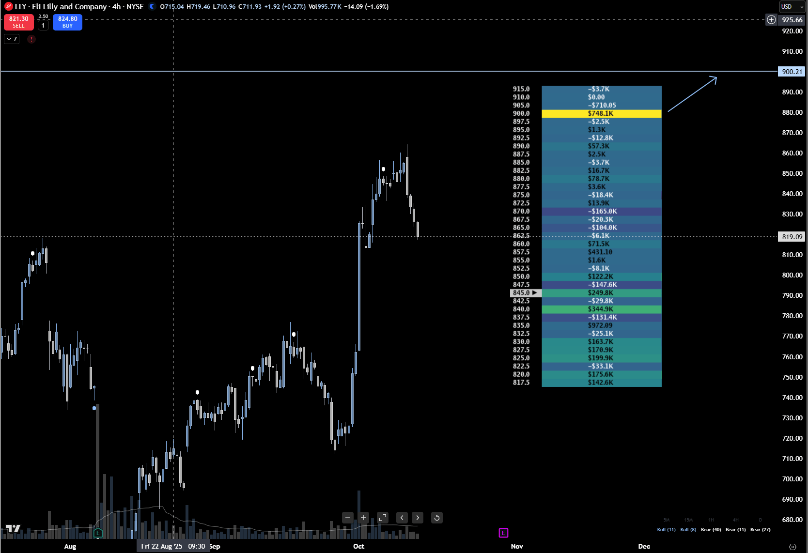

> ## Documentation Index
> Fetch the complete documentation index at: https://docs.skylit.ai/llms.txt
> Use this file to discover all available pages before exploring further.

# Best practices

> The key to mastering Heatseeker™ is to use it as context, not as a signal generator.

## Best Practices

The key to mastering **Heatseeker™** is to use it as **context**, not as a **signal generator**.\
Each node represents a *story of positioning*, not a direct “buy here / sell here” instruction.

### 1. Use Nodes as Context — Not Signals

* Treat each node as a **level of interest**, not a trade trigger.
* Let **price action** confirm your setups — Heatseeker™ is a lens, not an entry system.
* A node’s significance depends on how **price reacts** to it, not just its size.

  * *Example: LLY for the week of October 6th, 2025 showed a king node at \$900, but had already had a massive leg up. The probability that this 900 node will get hit is much less because of the massive upside rally that had already occurred.*

  

> Think of Heatseeker™ as your **map** — price action is the **compass**.

### 2. Stay Fluid, Not Biased

* Don’t anchor to a single **bullish or bearish thesis**.
* Be flexible — if the **map reshuffles**, adapt to it.
* Stubborn bias leads to drawdowns; flexibility keeps you aligned with market makers.

> **Discipline > conviction.** You’re reading flow, not fighting it.

### 3. Focus on Asymmetric Risk-to-Reward

Your objective is not to be *right* more often — it’s to win **bigger when you’re right** and lose **smaller when you’re wrong**.

* Prioritize **setups with clear asymmetric R:R**.
* If risk and reward are close to 1:1, skip the trade — there’s no edge.
* Focus on **edges of ranges** and **deflection points**, where the payoff potential is greatest.

> Winning traders think in *ratios*, not in *win rates*.

### 4. Don’t Fight the Map

* When the heatmap **reshuffles**, the market structure has changed.
* Don’t cling to old levels — **pause**, observe, and re-evaluate.
* The best trades come from **waiting for clarity**, not forcing trades through uncertainty.

> “When in doubt, zoom out.”\
> A new map = new game.

### 5. Combine GEX and VEX for Confirmation

One of the most powerful confirmations in Heatseeker™ comes from **GEX/VEX confluence** —\
when both forces align around the same price zone.

#### Why It Matters:

* When **GEX and VEX overlap**, that zone carries **stronger influence** on price.
* These alignments increase the odds of **holding or reversing** at that level.
* Works exceptionally well for **swing trades** and **intra-day fades**.

#### How to Trade It:

* Watch for **bounce setups** forming at a GEX/VEX overlap zone.
* Treat these as **zones of interest**, not precise levels.
* Use price confirmation before entering.

> **Confluence = Confidence.**\
> The more alignment between GEX, VEX, and price action, the higher your probability of success.

### 6. Look for Confluence Among the Indices

* Magic happens when heatmaps line up.
* The highest probability plays occur when SPX, SPY and QQQ are all in agreement for a major reversal.
* Ask Yourself: "If I were to take a trade based off SPX heatmap, would my thesis still hold true if I took it on QQQ instead?"

#### Why It matters:

* A floor on SPX can prevent a rug on QQQ just as much as a ceiling on SPY can prevent a rally on SPX.
* A significant king node on SPY to the downside can cause whippy rejections of key nodes even if massive upside nodes exist on SPX and QQQ.

***Key point: All 3 indices can influence each other in dynamic ways. - by observing nodes based on size, rate of change and position, we can gather clues as to how price will behave throughout the day.***

### Quick Recap

| Practice               | Focus                     | Benefit                        |
| ---------------------- | ------------------------- | ------------------------------ |
| Nodes as Context       | Use as levels of interest | Avoid overtrading noise        |
| Stay Fluid             | Adapt to map reshuffles   | Stay aligned with flow         |
| Asymmetric R:R         | Focus on edges            | Maximize edge potential        |
| Don’t Fight the Map    | Wait for clarity          | Avoid false reversals          |
| GEX/VEX Confluence     | Dual-layer confirmation   | Boost probability & conviction |
| SPY/SPX/QQQ Confluence | Triple-layer confirmation | Highest probability outcomes   |

***

> **Final Thought:**\
> Heatseeker™ gives you visibility into dealer positioning — but **discipline, timing, and patience** make the tool powerful.\
> The map shows the structure, but *you* decide when to act.
