> ## Documentation Index
> Fetch the complete documentation index at: https://docs.skylit.ai/llms.txt
> Use this file to discover all available pages before exploring further.

# Core Concepts

> Each strike displays a value (positive or negative), and each value is represented by a color:

## Core Concepts

### Nodes

**Heatseeker™** is built to reveal **dealer exposure** at each strike price and expiration.\
Each strike displays a **value** (positive or negative), and each value is represented by a **color**:

| Exposure Type         | Color Range    | Typical Behavior                    |
| --------------------- | -------------- | ----------------------------------- |
| **Positive Exposure** | Green → Yellow | Lower-volatility interaction        |
| **Negative Exposure** | Blue → Purple  | Higher-volatility, “wicky” movement |

#### Key Principle

The most important factor is **not** whether a node is positive or negative — nor its color.\
What truly matters is the **absolute value** of the node.

> The **larger** the absolute value, the **stronger** the pull it exerts on price.

#### How Price Interacts with Each Node

* **Positive Node →** Lower-volatility interaction; price tends to move **smoothly**, with fewer wicks or spikes.
* **Negative Node →** Higher-volatility interaction; price becomes **wicky** and more **violent**.\
  When price interacts with a **negative gamma node**, it can **overshoot** before reversing — this is how market makers often **trap retail traders** on the wrong side of the move.

### Concept of Magnets

Every node on the Heatseeker map acts like a **magnet** in the market.\
Price is **attracted** to these zones due to dealer positioning — yet these same areas can also act as **walls** that repel price and create reversals.

#### Magnetic Behavior

* As price **moves farther away** from a high-value node → the **magnetic pull weakens**.
* As price **approaches** a high-value node → the **magnetic pull strengthens**.
* When price **directly interacts** with a node, a **deflection or repulsion** may occur — similar to when two positive ends of a magnet meet and push apart.

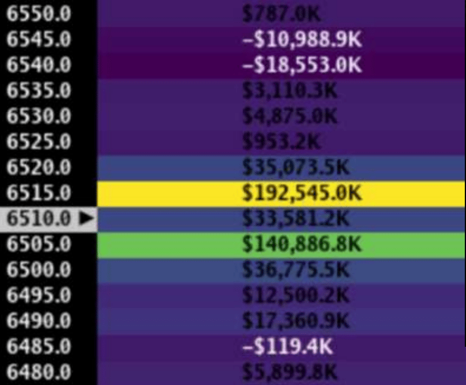

> Think of nodes as **dynamic magnets** — their influence grows as price converges and fades as it diverges.

### King Nodes

**King Nodes** are the **highest absolute value nodes** on the heatmap.\
They represent where **Market Makers (MMs)** hold the **greatest exposure** — and where price often **gravitates near expiration**.

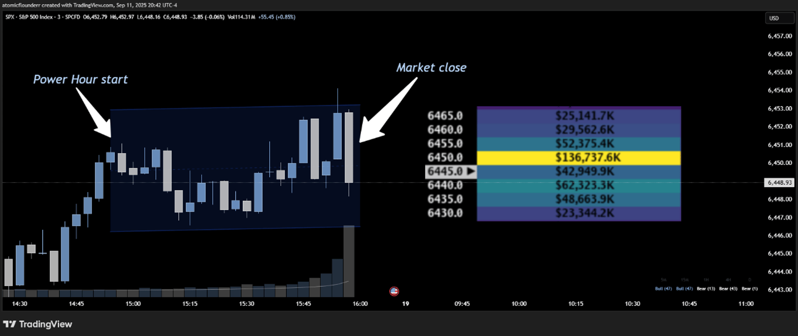

#### Key Characteristics

* There can be **multiple significant nodes** with large values.
* When multiple strong nodes exist, they can **pull in opposite directions**, creating **range-bound pinning** or **whipsaw movement**.

#### Price Behavior Around King Nodes

1. **Pin Jobs (Common near End of Day)**\
   MMs often pin price near the King Node late in the session.

   * Tight ranges form.
   * **Scalping the range edges** tends to work best.

   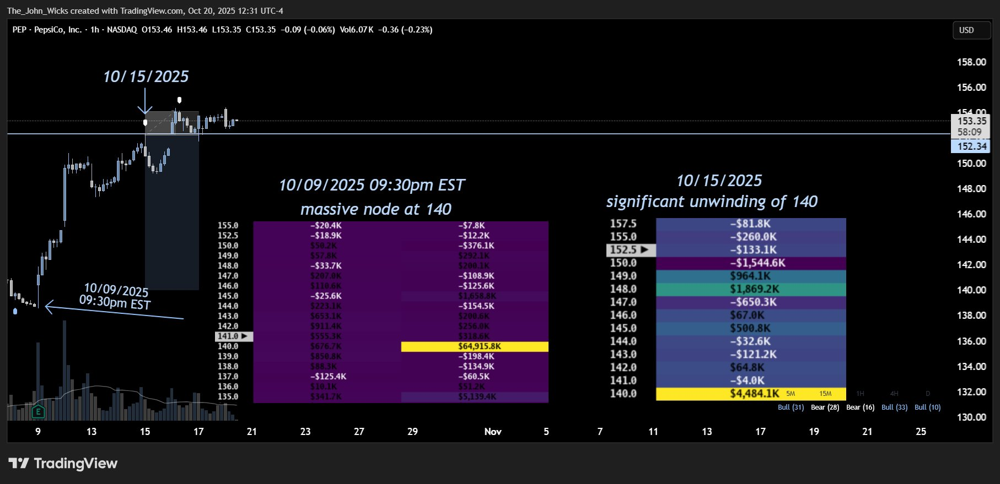
2. **Drives Away (Common early in the day)**\
   When price reaches the King Node **too early**, MMs may push it away.\
   Holding price there all session would require constant defense, so they often trigger an early **drive-off**.

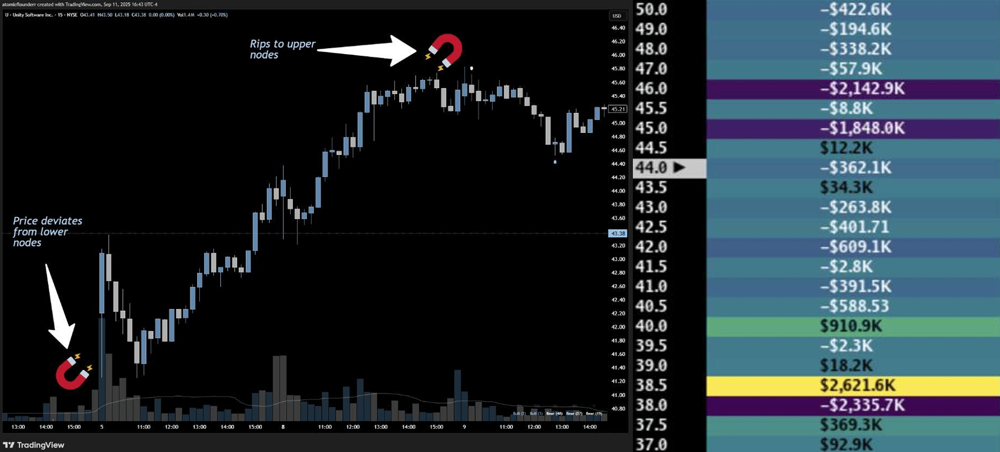

#### Margin of Interaction

King Nodes don’t always reject **to the exact cent**.\
Expect a **deflection margin** of roughly **5–10 points on SPX**.

> Note: A rejection occurring 5½ points away from the King Node is still considered valid, as noted in the example above.

### Gatekeeper Nodes

**Gatekeeper Nodes** act like **bouncers at the door of a nightclub** — they prevent price from easily reaching the King Node.

These nodes function as **deflection points** that can cause major directional shifts.

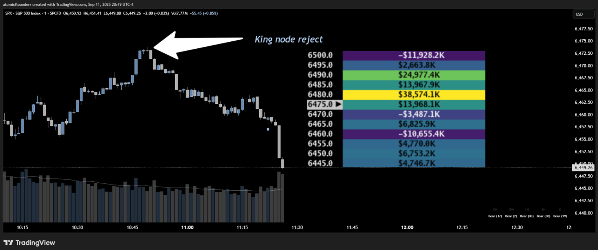

#### Behavior

* If price **tests and fails** at a Gatekeeper Node → the map can **reshuffle**.
* **Reshuffles** often precede a **trend change** or **realignment** of where dealers aim to pin price.
* Gatekeeper rejections near the **start of the day** often mark **high-probability reversals**.

> After rejection, reshuffles occur — and clarity emerges on the next directional bias.

### Midpoints

**Midpoints** are Market Makers’ favorite **trap zones** — and they offer the **worst risk-to-reward** for directional traders.

* Unless you’re an **option or spread seller**, avoid trading them.

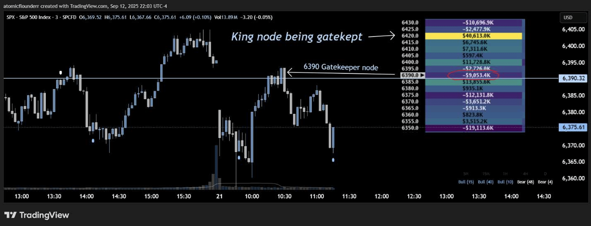

#### Why Midpoints Are Dangerous

* Market Dealers love **range-bound** conditions.
* The **upper and lower ranges** are easily visible on the heatmap.
* When price is **in the middle of the range**, direction becomes **uncertain**.

At best, your **risk-to-reward** is roughly **1:1** — not asymmetric and not worth taking.

> **B*****etter Strategy: Wait for price to approach the edge of the range and fade the edge.***\
> ***Fading extremes offers the best R:R and highest probability.***

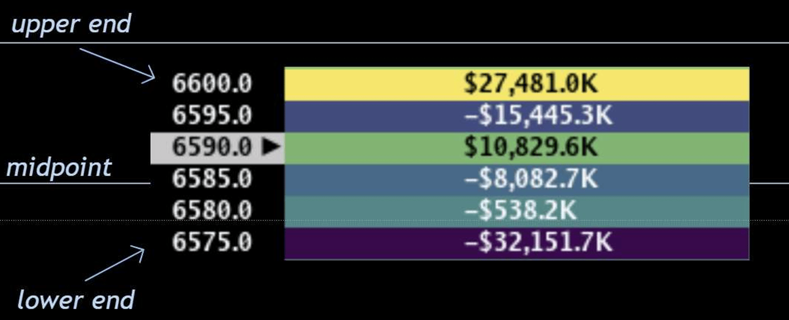

### Price Delivery & Node Retests

When looking for **bounce plays** off a node, **context matters** — not all nodes retain influence forever.

#### Node Retest Strength

| Touch              | Reaction Strength | Probability | Notes                                    |
| ------------------ | ----------------- | ----------- | ---------------------------------------- |
| **First Touch**    | Strongest         | Highest     | Fresh liquidity; MMs defend aggressively |
| **Second Touch**   | Moderate          | \~66%       | Often forms double tops/bottoms          |
| **Third+ Touches** | Weakest           | \~33%       | Reduced probability of reversal          |

If price has already been **delivered from** a node (touched and moved away), its **influence weakens**.\
Each additional test reduces the likelihood of a strong bounce.

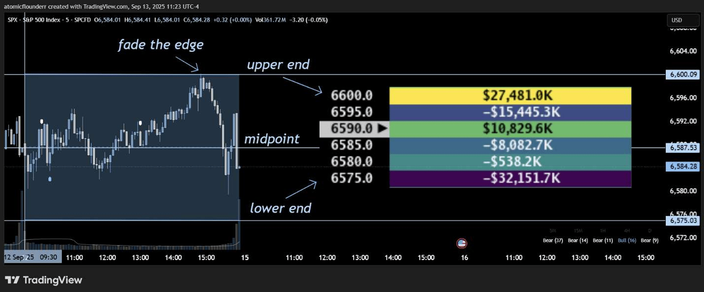

* *Caption: ACN 240 node test, targeting upside nodes, from September 10th, 2025.*

> **Key Takeaway:**\
> Prioritize **untouched nodes** for bounce plays — treat previously tested ones with caution.

### Price Delivery From a Node

When price bounces off a Gatekeeper node or King node, we don't always get reversion back to that specific node!

* A node that has been interacted with tends to have less influence over price action, because the node is no longer "fresh".
* The probability of reversion back to that node becomes lesser, making conditions unfavorable for a green trade.

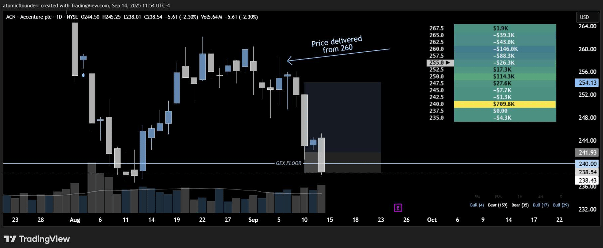

***Key note: Instead of trying to chase a node that has already been interacted with, it is better to move on to the next trade. Looking for the freshest levels possible provides the highest probability for success.***

### Price Delivery and Actionable Trades

* If price gets a rejection (in a bearish scenario) or a bounce (in a bullish scenario) off a node, a few things may occur:

  * Gradual decrease of the node we were delivered from - in this case, the likelihood of a return back to the node in question becomes low probability.

    *PEP Price Delivery Case Study From October 15th, 2025 at 09:30am EST*

  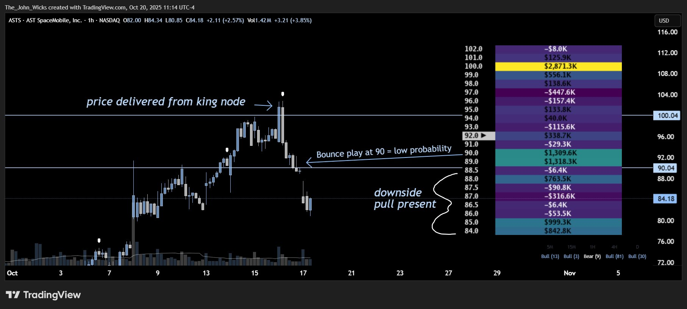

  * Increase of the node we were delivered from - higher likelihood of a reversion back to the node in question.

  *By keeping an eye on key nodes for rate of change, we can make inferences as to whether a reversion back to a deflection node is likely. Looking for increase in size of node gives us higher likelihood for price to return, whereas a decrease in node size gives us lower likelihood for reversion.*

### Robinhood Power Hour Liquidation

At **3:30 PM EST** (30 minutes before market close), Robinhood begins **auto-liquidating** accounts that fail margin requirements.\
This creates **forced order flow** in highly liquid names like **SPX, SPY, and QQQ**.

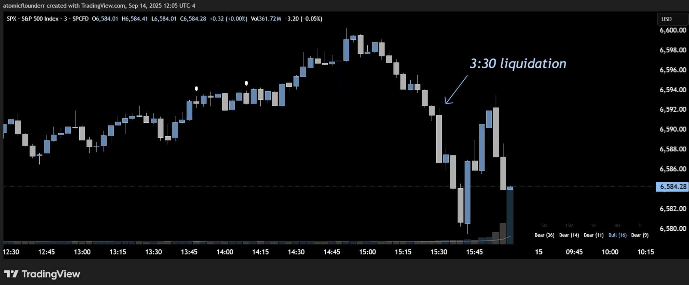

#### Why It Matters

* Triggers **volatility spikes** right before close.
* Can **force breakouts or fakeouts** near Gatekeeper Nodes.
* Near a **King Node**, can **accelerate** the move.
* Sometimes reshuffles the entire map.

> Always stay alert to **Power Hour volatility** — it’s often broker-driven and mechanical, not organic.

### Rate of Change of a Node

Heatseeker™ not only shows **dealer positioning**, but also **how fast liquidity changes**.

#### Reading Node Momentum

* **Rapid Accumulation →** Dealers are quickly adding exposure; acts like a **magnet** that pulls price in strongly.
* **Rapid Unwinding →** Exposure vanishes; levels that looked strong may suddenly **weaken**.
* Fast changes often cause **volatility spikes**, **explosive moves**, or **sharp reversals**.

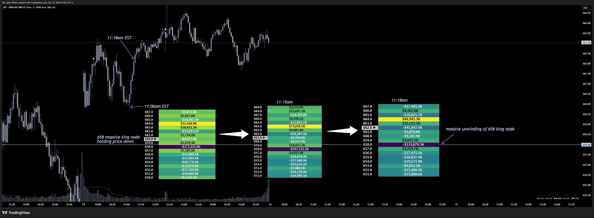

> Watch the **rate of change** — it reveals urgency and intent behind Market Maker adjustments.

### Rolling of Ceilings / Floors

Another key concept in relation to node rate of change is the behavior in how rate of change occurs:

* ***Rolling of ceilings*** - Considered strong presumptive evidence of a bearish thesis playing out.
  * Occurs when we see the upside ceiling and/or upside price targets decrease in value with the ceiling moving to a lower strike.
* ***Rolling of floors*** - Considered strong presumptive evidence of a bullish thesis playing out.
  * Occurs when we see the downside floor and/or downside price targets decrease in value with the floor moving to a higher strike.

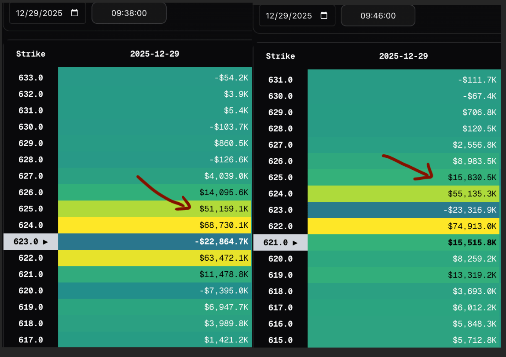

### Hedge Nodes

**Hedge Nodes** appear during **major news or macro events** — such as FOMC, CPI, JOLTS, NFP, or earnings.\
They represent **large, protective positions** that sit **farther from price** and move **slowly** throughout the day.

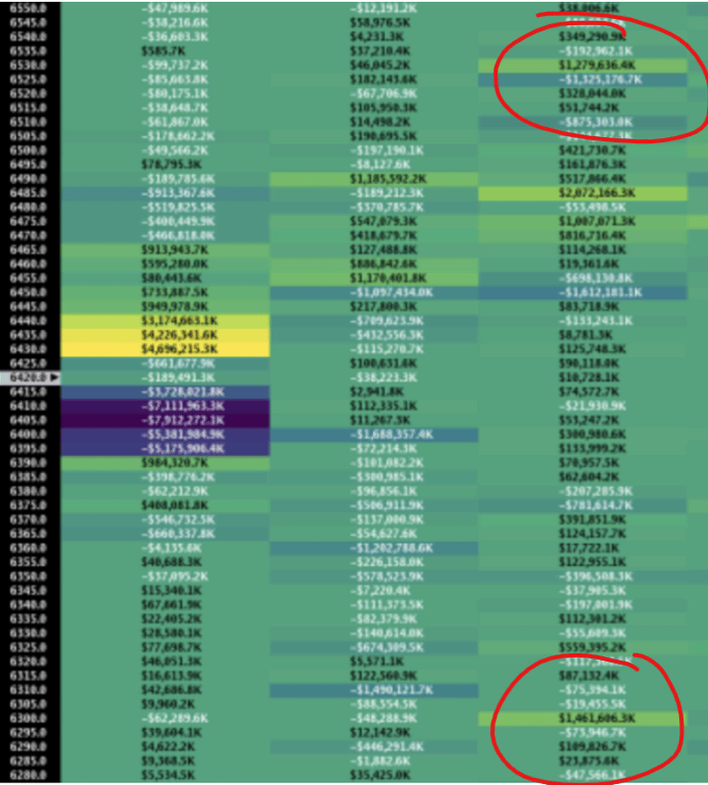

#### Characteristics

* Typically **static or slow-unwinding**.
* Can appear **above and below price** simultaneously, typically far away from current spot price.
* Function like **insurance** rather than active magnets.

The **closer** a Hedge Node is to current price, the **more it shapes intraday behavior**.\
The **farther** it is, the **less influence** it exerts.

> Watch for **gradual unwinds** of large hedge nodes — they often signal changing Market Maker expectations.

### Air Pockets

Air Pockets occur when maps show a zone of low volume and/or small sized nodes that price can move easily through due to the lack of resistance/activity within that zone.

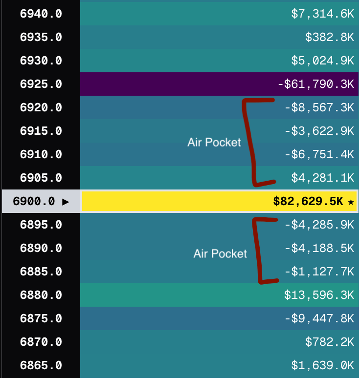

* The quality of the nodes (negative gamma vs positive gamma) can affect how sharp a move price can have.
  * If price action is moving through a negative gamma air pocket region, the moves can be much more violent / sharp.
  * If price action is moving through a positive gamma air pocket region, the moves can be much more mild / slow.

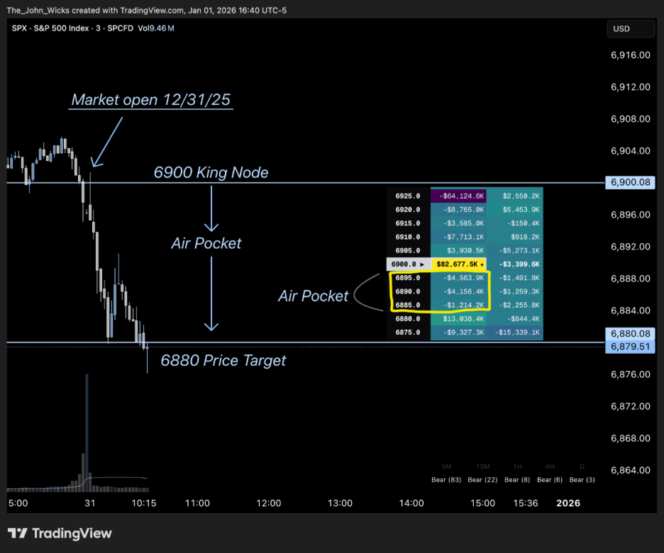

Context matters - technical analysis and confluence among the other heatmaps (in trinity mode) can affect the ability for price to move through an air pocket.

* ***Just because we have an air pocket does not ALWAYS mean we will fly through it, rather its something to keep in mind when analyzing trinity mode. Confluence matters.***

### OPEX Nodes

Every **third Friday** of the month marks **OPEX Week** — the monthly options expiration cycle.

#### What Happens During OPEX

* Nodes may carry **less weight**, since many contracts are set to **expire**.
* Positions roll off or reset, leading to **temporary distortions** in dealer positioning.
* After OPEX week passes, **directional bias** and **map clarity** typically **improve immediately**.

> Treat OPEX week levels with caution — probabilities are temporarily skewed.

***

**In Summary:**

* Focus on **absolute value** — not color or sign.
* Favor **untouched nodes** over retested ones.
* Watch **rate of change** for clues on momentum.
* Avoid **midpoints**, **respect gatekeepers**, and **track king nodes** daily.
* Be mindful of **external catalysts** like **Power Hour**, **OPEX**, and **Hedge Nodes**.
