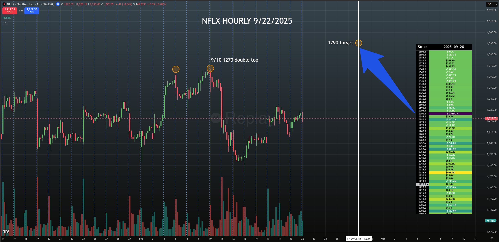
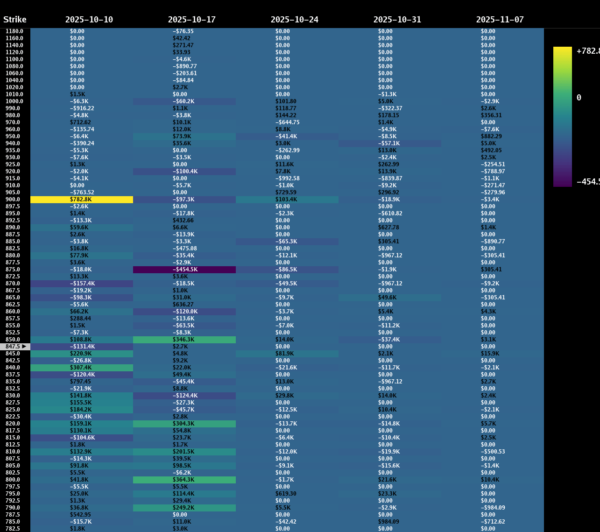
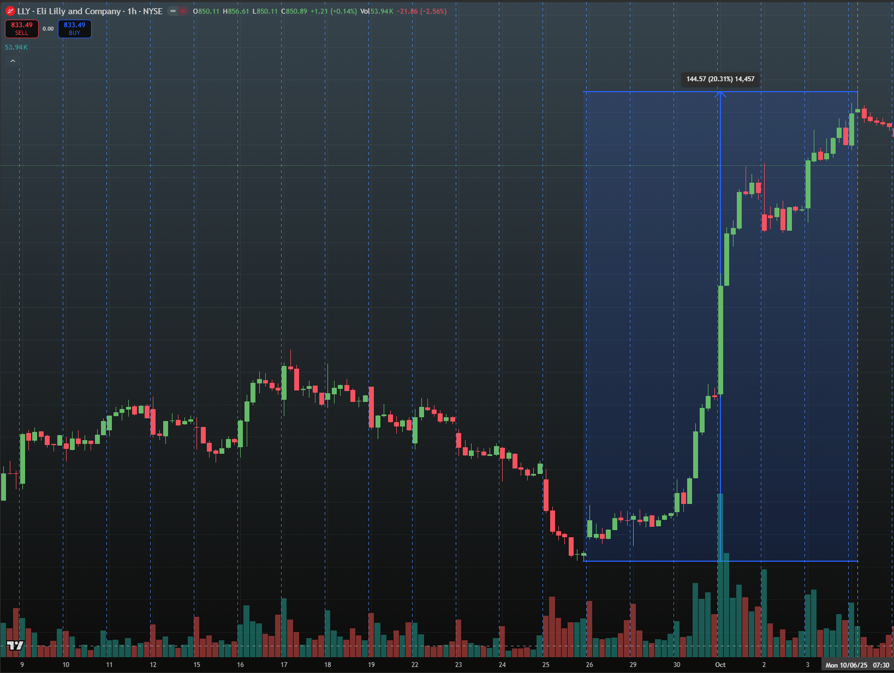

> ## Documentation Index
> Fetch the complete documentation index at: https://docs.skylit.ai/llms.txt
> Use this file to discover all available pages before exploring further.

# CASE STUDY: SPECULATIVE AND DECOY NODES

> On occasion, a heatmap may display a far out of the money (OTM) node that is likely to be speculative or manipulative in nature. In both cases, traders…

On occasion, a heatmap may display a far out of the money (OTM) node that is likely to be speculative or manipulative in nature. In both cases, traders should treat these heatmaps with a high degree of skepticism, and pair it with the chart to see if such a move is likely.

<Tabs>
  <Tab title="Netflix (NFLX) 1290">
    

    This heatmap shows a distinct node at 1290, which is roughly 3 times the value of the 1232.5 gatekeeper node and a full 5.5% from where price was trading (1222).

    However, there are several things to consider before jumping into a long position:

    1\) Multiple gatekeeper nodes at 1232.5 and 1252.5

    2\) There are a lack of prominent nodes to the upside for the next week over, reinforcing the impression that this node is more likely to be speculative or a decoy than a realistic price target.

    3\) Price would have to run a full 5.5% within a span of 4 trading sessions to reach its target, leaving almost no time for consolidation. With the presence of multiple gatekeeper nodes, buying momentum would have to be significant.
  </Tab>

  <Tab title="Eli Lilly (LLY)">
    

    LLY is another cautionary tale for speculative nodes. On 10/6/25, the heatmap for LLY showed a node of interest at the 10/10 900 strike with the highest absolute value out of any other node on the heatmap up until that point, implying 50 points of upside. However, we must first consider the context of how price arrived at 847.

    

    Price had already been delivered from the 710 strike in an almost vertical fashion, running almost 150 points in the past week with only two days of consolidation during that period. Another 50 points of upside within a span of 4 days would be improbable at best, as it would be more likely that some profit taking occurs and LLY enters another period of consolidation.
  </Tab>
</Tabs>
