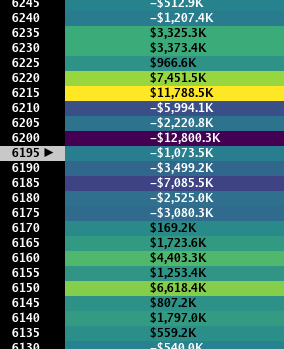
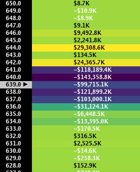
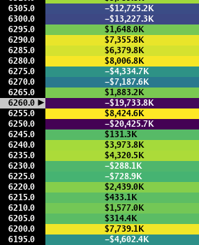

> ## Documentation Index
> Fetch the complete documentation index at: https://docs.skylit.ai/llms.txt
> Use this file to discover all available pages before exploring further.

# PATTERN: Rainbow Road

> This heatmap is characterized by having multiple prominent nodes of positive and negative values, in many cases bearing a resemblance to a rainbow. Another…

## DESCRIPTION

This heatmap is characterized by having multiple prominent nodes of positive and negative values, in many cases bearing a resemblance to a rainbow. Another distinct feature of this heatmap is the lack of a clear range for price to trade within, heralding choppy and erratic price action.

## HOW TO APPROACH

It is highly advisable to avoid trading when positioning is vague. Instead, wait for a higher probability setup to form.

<Tabs>
  <Tab title="Example 1">
    

    Indecisive positioning near the beginning of the session, with nodes of interest spread across an 80-point range. (07/02/25)
  </Tab>

  <Tab title="Example 2">
    

    Multiple prominent purple nodes in the 641-637 range suggest choppy and erratic price action. (08/19/25)
  </Tab>

  <Tab title="Example 3">
    

    A cluster of prominent nodes can be seen across a 100-point range.. (08/07/25)
  </Tab>
</Tabs>
