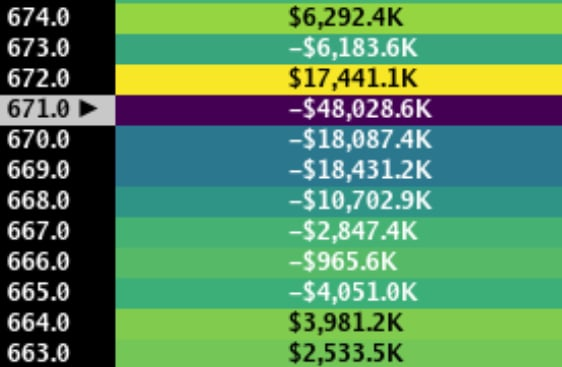
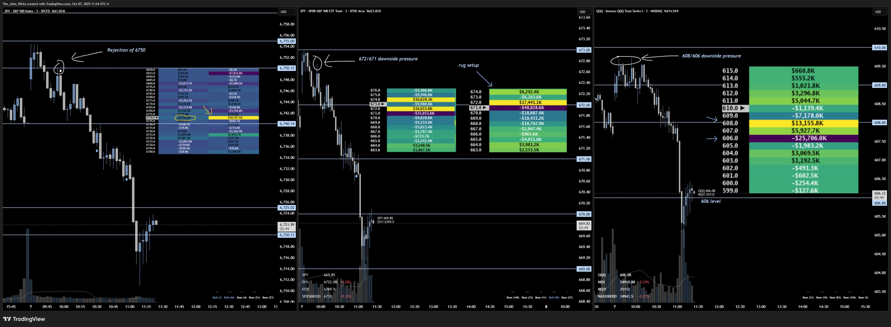

> ## Documentation Index
> Fetch the complete documentation index at: https://docs.skylit.ai/llms.txt
> Use this file to discover all available pages before exploring further.

# PATTERN: RUG SETUP

> When we have a yellow node stacked above a purple node with no obvious floor in sight, we can identify the setup as a rug setup.

## DESCRIPTION

When we have a yellow node stacked above a purple node with no obvious floor in sight, we can identify the setup as a rug setup.

* Why? - The negative gamma ceiling will accelerate the rejection of the positive gamma ceiling, almost like "setting gasoline on the fire". The negative gamma floors at 670 and 669 will also accelerate the move down.

## EXAMPLE: SPX/SPY/QQQ 10/7/25

* Early in the day, we noticed some pretty heavy sized nodes for next day expiration, likely hedge nodes. These heavy sized nodes could have some influence over price action today.
  * As the morning scramble began, I kept noticing SPX 6720 nodes growing gradually, with very little upside accumulation on all 3 indices. My bias at this point in time was a short bias.
  * no upside accumulating, downside growing.
* ***SPX:***
  * very little activity at the start of day, but we saw growth to the downside.
* ***SPY:***
  * had downside pressure at 672 / 671 nodes that continued accumulating, preventing price from grinding higher.
  * identified a rug pull setup developing, in which we have a yellow node stacked above a purple node. When that yellow node unwinds, we can get rapid and violent reactions to the downside.
    * All those negative gamma nodes below would also accelerate price nosediving, with no clear floor in sight.
* ***QQQ:***
  * Was sitting above its king node, with very little upside accumulation.
  * 608 / 606 remained lit up. Because of this, we can think of those nodes as price targets. All we needed was a catalyst, which in this case, was ***SPYs rug setup.***

Actionable entries were at the rejection of 6750 on SPX, the double top liquidity hunt on QQQ, or the bearish golden pocket retracement on SPY, targeting key nodes to the downside. Very little to zero drawdown if you caught, extremely high reward!

