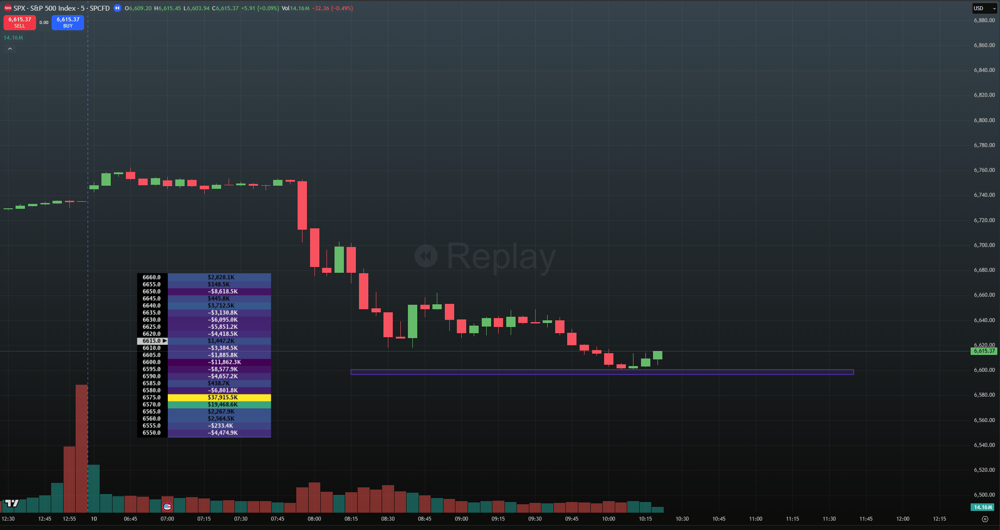
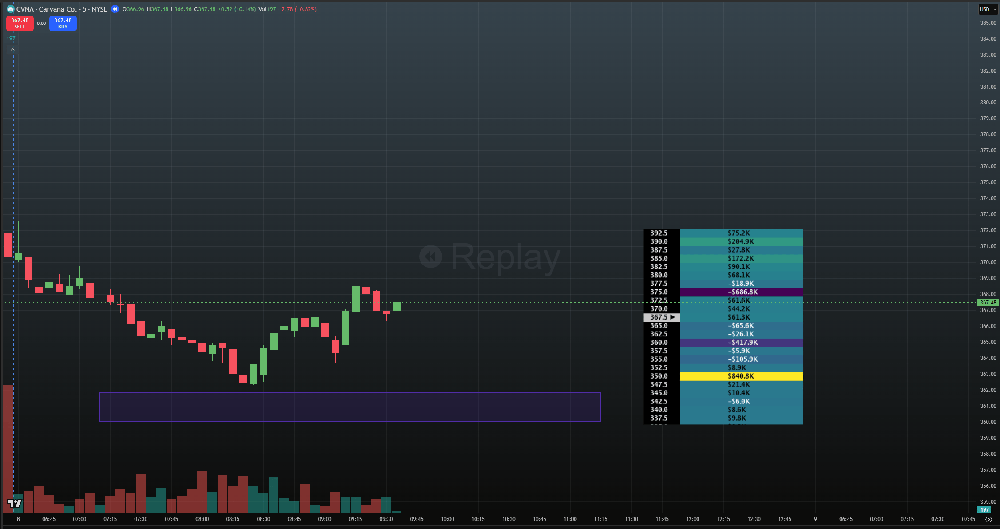
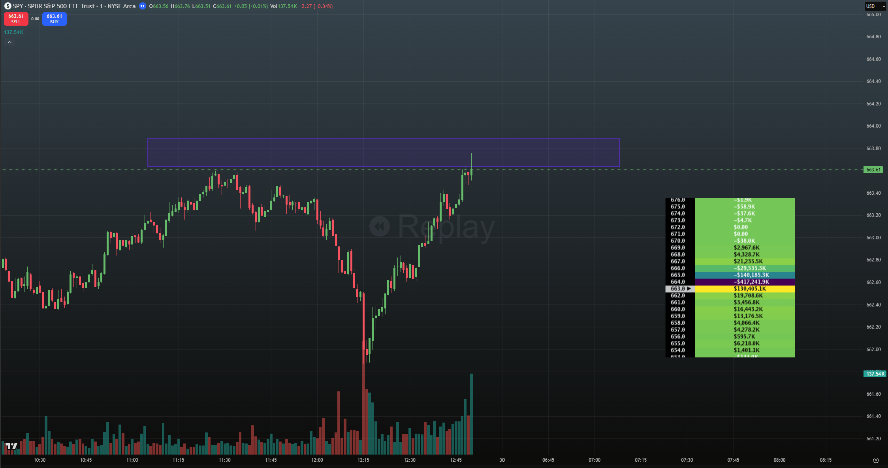

> ## Documentation Index
> Fetch the complete documentation index at: https://docs.skylit.ai/llms.txt
> Use this file to discover all available pages before exploring further.

# PATTERN: The Gatekeeper

> A Gatekeeper node is a commonly seen heatmap setup where a high-value node sits between price and further high-value nodes, preventing continuation. This…

## DESCRIPTION

A Gatekeeper node is a commonly seen heatmap setup where a high-value node sits between price and further high-value nodes, preventing continuation. This node then serves as a key support or resistance level.

## HOW TO APPROACH

It is generally advisable to mark out gatekeeper strikes on the chart, and to scale out of a position as price approaches that level.

One course of action would be to play a reversal as price approaches that node, especially if the value of the Gatekeeper node is far in excess of the nodes beyond it.

As always, price action and market structure must dictate whether or not to take a trade off a gatekeeper node.

<Tabs>
  <Tab title="Example 1">
    

    6600, a key psychological level, "gatekeeps" price - currently at 6615- from trading into the further downside nodes. (10/10/25)
  </Tab>

  <Tab title="Example 2">
    

    A supportive node at the 360 strike serves as a potential obstacle between spot and the ultimate target of 350. CVNA (10/08/25)
  </Tab>

  <Tab title="Example 3">
    

    SPY has a clear upside skew, but a distinct gatekeeper node at 664 stalls any movement to the upside. Compare the value of the gatekeeper node against the second highest-value node. (09/29/25)
  </Tab>
</Tabs>
