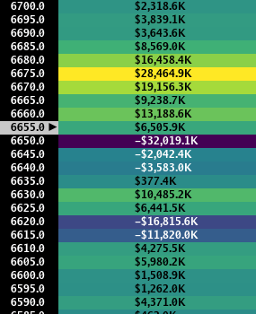
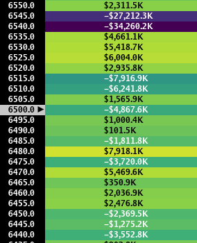
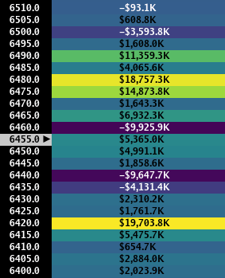

> ## Documentation Index
> Fetch the complete documentation index at: https://docs.skylit.ai/llms.txt
> Use this file to discover all available pages before exploring further.

# PATTERN: The Whipsaw

> Price trades in a wide range, the edges of which are defined by the presence of at least two high value nodes with few prominent nodes in between.

## DESCRIPTION

Price trades in a wide range, the edges of which are defined by the presence of at least two high value nodes with few prominent nodes in between.

## HOW TO APPROACH

Approaching a Whipsaw pattern is similar to trading a range - the highest risk/reward opportunities lie in fading the edges of the range. It is strongly advisable to avoid initiating a position in the middle of the range, especially with 0DTE options, as theta decay and the unstable behavior of price can rapidly erode premiums.

<Tabs>
  <Tab title="Example 1">
    

    Price is oscillating between the 6650 and 6675 strikes. (09/24/25)
  </Tab>

  <Tab title="Example 2">
    

    Price is fluctuating in a loose range between 6545 and 6480. (09/09/25)
  </Tab>

  <Tab title="Example 3">
    

    Price is oscillating between the 6480, 6460, and 6440 strikes. Note that in this example, there are four high value nodes of interest. (09/05/25)
  </Tab>
</Tabs>
