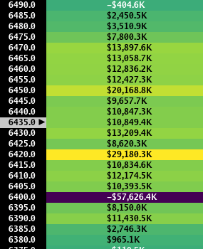
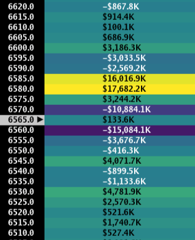
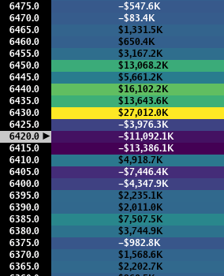

> ## Documentation Index
> Fetch the complete documentation index at: https://docs.skylit.ai/llms.txt
> Use this file to discover all available pages before exploring further.

# PATTERN: Trend

> Price fixates on a king node far away from spot with comparatively small counter-directional skew. As it trades towards the initial king node, it then…

## DESCRIPTION

Price fixates on a king node far away from spot with comparatively small counter-directional skew. As it trades towards the initial king node, it then selects the node above it as the new king node. If price begins to trade away from the king node, observe the changes in the values around that node's strike. If the values of those nodes remain relatively unchanged or even increase, it is a signal that price may eventually begin to trade towards it.

Mechanically, the nodes away from price should fade in value while the values in the direction of the trend increase in value.

## HOW TO APPROACH

Because of the stair-stepping pattern of trend days, it is advisable to enter on pullbacks so long as price action and the heatmap support the trend. "Chasing" price on a trend day should only be done to the extent that an asymmetrical risk/reward ratio allows.

<Tabs>
  <Tab title="Example 1">
    

    Price trades downwards to the 6400 strike with few nodes of significance above spot to provide an opposing force. (08/19/25)
  </Tab>

  <Tab title="Example 2">
    

    The 6585/6580 strikes provide an upward skew. It is important to actively manage positions as price approaches closer and closer to these dual strikes. (09/11/25)
  </Tab>

  <Tab title="Example 3">
    

    Price locks onto the 6430 strike as its initial target. We can observe a clear bullish skew as the absolute value of the 3 nodes above spot dwarf that of the 3 nodes below. (10/01/25)
  </Tab>
</Tabs>
