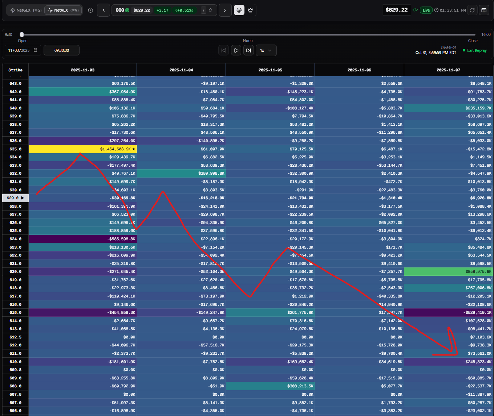
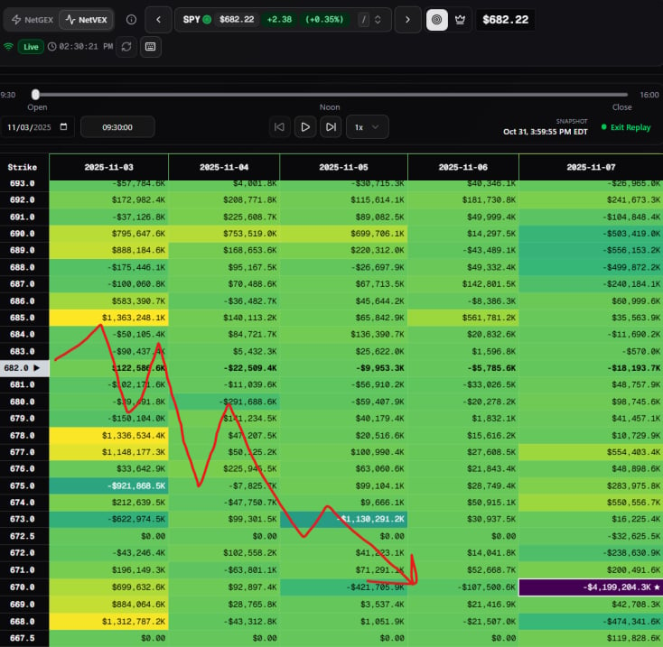
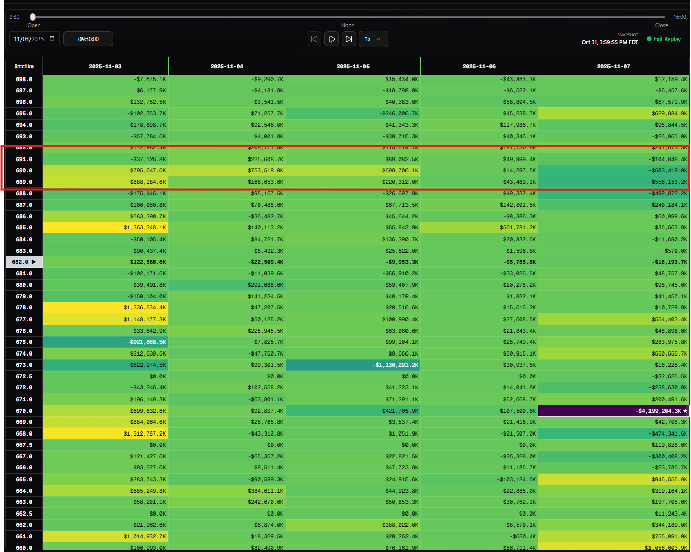

> ## Documentation Index
> Fetch the complete documentation index at: https://docs.skylit.ai/llms.txt
> Use this file to discover all available pages before exploring further.

# TOPPING PATTERNS / BOTTOMING PATTERNS:

> This is a guide on how to spot potential higher timeframe trend shifts on the indices. We'll be looking primarily at the VEX positioning rather than the GEX…

## Introduction:

This is a guide on how to spot potential higher timeframe trend shifts on the indices. We'll be looking primarily at the VEX positioning rather than the GEX positioning, as it is a reliable source for determining where dealers will be positioned in the sessions ahead.

## **Bearish Positioning for the Week of 11/7/2025:**

* VEX was looking toppy on SPY and QQQ. We can determine this because of a lack of accumulation to the upside nodes.
* 685 SPY was a strong gatekeeper node with very minimal upside accumulation at 690. With price having been delivered from 690 a few days ago, I found the probability of us going back up to 690 was low.

  
* QQQ had a similar outlook as SPY, with a king node at 635 and high accumulation into the next few days. Similar to SPY, we observed that same stair-stepping pattern. This is a significant confluence to consider.

  

***Key point: if the indexes are showing little to no upside accumulation, we can conclude that we may be reaching a "market top". Notice how on SPY we had multiple levels of resistance with no signs of continuation higher.***

## How to trade this bearish bias:

Though VEX positioning shows how dealers are postured in the days ahead, the strategy of trading this positioning is relatively straightforward: by playing node rejections with the knowledge that dealers are postured in an extremely bearish manner. Keep in mind that maps can shuffle at a moment's notice, whether that's intraday or for the days ahead.

An invalidation of this bias would simply be the opposite of how it was formed: higher accumulation at higher strikes, dissipation of values at lower strikes, and stronger positioning closer to the money.

## Outcome:

As the heatmaps indicated, SPY sold all the way down to 661, with QQQ tapping its weekly low at 598, a nearly 3% move from peak to trough.

## Quiz:

1. What is a valid piece of criteria in identifying how market dealers are positioned?
   1. An analyst report claiming that the indices are due for a pullback.
   2. \$5m in put options being bought on SPY
   3. Stairstep VEX exposure to the downside, with comparatively little accumulation to the upside.
   4. Your fib levels show that the market is overextended.

<Accordion title="Answer:">
  C. Dealer positioning is expressed through the Greeks.
</Accordion>
